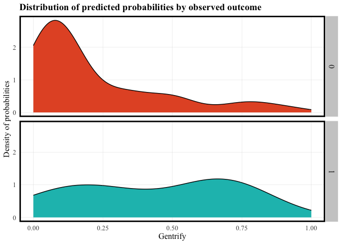

# Abstract
Defining and predicting gentrification is becoming more and more relevant to the average person as neighborhood residents become more concerned about getting priced out of their communities. Once something that could only be observed in hindsight, anticipating gentrification and attempting to prevent its disparate effects has become the subject of activism and counter-lobbying efforts. This report attempts to determine if gentrification can be correctly identified in Baltimore City, Maryland based on neighborhood characteristics that the average person can observe.


# About Baltimore City
Baltimore City, Maryland sits on the Patapsco River and is home to over 585,000 people (2020 Census). An incredibly historic city, though Baltimore was once full of rigorous industry, unbridled American patriotism, and wealth, its late 20th century reality was plagued by extreme disinvestment, high crime, and white flight.


:::: {style="display: flex;"}

::: {}


:::

::: {}


:::

::::

Baltimore is less than an hour North of Annapolis, MD (the state capital) and Washington, DC as the crow drives. Baltimore/Washington International Airport (BWI) does not lie within Baltimore City boundaries.

# Defining Gentrification
We define our Gentrification Index per CT as follows:

GI = (∆ Low Income Proportion) + (Percent Change of Rent) + (Percent Change of Home Value) 

The change is calculated by subtracting the 2012 values from the 2022 values. If the change in proportion of high income residents is below 1, and the change in proportion of low income residents is above 1, then the equation would result in a negative number and would indicate that more poor residents have “moved” in - and would not indicate the occurrence of gentrification. If the change in proportion of high income residents is above 1, and the change in proportion of low income residents is below 1, then the equation would result in a positive number and would indicate that more wealthy residents have “moved” in - a key indicator of gentrification. 


```r
#Getting population by Income numbers
bmore_ctmedhhinc12 <- get_acs(
  geography = "tract", 
  variables = c(tot = "B19001_001", 
                L = "B19001_002", L = "B19001_003", L = "B19001_004", L = "B19001_005", L = "B19001_006",
                H = "B19001_007", H = "B19001_008", H = "B19001_009", H = "B19001_010", H = "B19001_011", 
                H = "B19001_012", H = "B19001_013", H = "B19001_014", H = "B19001_015", H = "B19001_016", 
                H = "B19001_017"),
  state = "MD", 
  county = "Baltimore City",
  year = 2012,
  geometry = FALSE 
) %>%
  select(GEOID, variable, estimate) %>%
  rename(est12 = estimate, var12 = variable) %>%
  group_by(GEOID, var12) %>%
  summarise(est12 = sum(est12)) %>%
  pivot_wider(names_from = var12, values_from = est12) %>%
  mutate(percentHighInc12 = H/tot, percentLowInc12 = L/tot)

#adjusting for joined census tracts
changed_22Inc <- bmore_ctmedhhinc12 %>%
  filter(GEOID %in% c("24510180100", "24510180200")) %>%
  ungroup() %>%
  summarize(H = sum(H), L = sum(L), tot = sum(tot)) %>%
  mutate(percentHighInc12 = H / tot,
         percentLowInc12 = L / tot) %>%
  mutate(GEOID = "24510280600")

#joining info back to 2012
bmore_ctmedhhinc12 <- bmore_ctmedhhinc12 %>%
  ungroup()%>%
  filter(!(GEOID %in% c("24510180100", "24510180200"))) %>%
  bind_rows(changed_22Inc)

#getting HH income for 2022
bmore_ctmedhhinc22 <- get_acs(
  geography = "tract", 
  variables = c(tot = "B19001_001", 
                L = "B19001_002", L = "B19001_003", L = "B19001_004", L = "B19001_005", L = "B19001_006",
                L = "B19001_007", L = "B19001_008", L = "B19001_009", H = "B19001_010", H = "B19001_011", 
                H = "B19001_012", H = "B19001_013", H = "B19001_014", H = "B19001_015", H = "B19001_016", 
                H = "B19001_017"),
  state = "MD", 
  county = "Baltimore City",
  year = 2022,
  geometry = FALSE 
) %>%
  select(GEOID, variable, estimate) %>%
  rename(est22 = estimate, var22 = variable) %>%
  group_by(GEOID, var22) %>%
  summarise(est22 = sum(est22)) %>%
  pivot_wider(names_from = var22, values_from = est22) %>%
  mutate(percentHighInc22 = H/tot, percentLowInc22 = L/tot)
```


```r
ggplot() +
  geom_sf(data = water_bound, fill = "steelblue") +
  geom_sf(data = md_bound, fill = "gray80", col = "gray75") +
  geom_sf(data = all.acs.sf, aes(fill = gentrify), col = "cornflowerblue") +
  scale_fill_gradient(
    high = "#174B86",
    low = "#B4CFF5") +
  geom_sf(data = patapsco, fill = "steelblue", col = "transparent") +
  theme_void() +
  xlim(-76.75, -76.48) +
  ylim(39.2, 39.38) +
  theme(legend.position = "bottom", legend.key.width = unit(1.5, "cm")) +
  labs(fill = "Gentrification",
       title = "2022 Gentrified Census Tracts",
       subtitle = "Baltimore City, MD")
```

<!-- -->


# Data Collection
For testing the ability to predict gentrification, input features that could be observed by eye were sourced, cleaned, and used in the model. Our data sources primarily included the 2012 and 2022 5-year ACS (American Community Survey) from the U.S. Census Bureau and Open Baltimore (https://data.baltimorecity.gov/). 


```r
#change in walk score
ggplot() +
  geom_sf(data = water_bound, fill = "steelblue") +
  geom_sf(data = md_bound, fill = "gray80", col = "gray75") +
  geom_sf(data = walk_score_csa, aes(fill = changewalk), col = "transparent") +
  scale_fill_gradient(
    high = "#861D05",
    low = "#F5B5AC") +
  geom_sf(data = patapsco, fill = "steelblue", col = "transparent") +
  theme_void() +
  xlim(-76.75, -76.48) +
  ylim(39.2, 39.38) +
  theme(legend.position = "bottom", legend.key.width = unit(1.5, "cm")) +
  labs(fill = "Change in Walk Score",
       title = "2011 to 2017 Change in Walk Score",
       subtitle = "Baltimore City, MD")
```

<!-- -->

## Joining additional metrics


```r
p_load(nngeo,FNN,tibble, caret)

bmore_hoods <- bmore_p_lots %>%
  select(-p_vacant)

bmore_CSA_data <- bmore_p_lots %>%
  st_drop_geometry()%>%
  left_join(bmore_business)%>%
  st_as_sf()

bmore_CSA_data <- st_join(bmore_CSA_data, school_outcome, left = TRUE)%>%
  mutate(CSA = coalesce(CSA.x, CSA.y)) %>%
  select(-CSA.x, -CSA.y)%>%
mutate(across(everything(), ~replace_na(., 0)))

bmore_CSA_data <- st_join(bmore_CSA_data, walk_score, left = TRUE)%>%
  mutate(CSA = coalesce(CSA.x, CSA.y)) %>%
  select(-CSA.x, -CSA.y)%>%
mutate(across(everything(), ~replace_na(., 0)))

coldist <- baltimore_tracts
coldist$nearest_college_index <- st_nearest_feature(coldist, bmore_colleges)
coldist <- coldist %>%
  rowwise() %>%
  mutate(nearest_college = list(bmore_colleges[nearest_college_index, ]))
coldist <- coldist %>%
  mutate(coldist = st_distance(geometry, nearest_college$geometry))%>%
  select(-nearest_college_index,
         -nearest_college)%>%
  rename(collegedist = coldist)%>%
  st_drop_geometry()

acs.hoods <- all.acs.sf %>%
  st_transform(crs = st_crs(bmore_CSA_data))%>%
  st_centroid()%>%
  st_join(bmore_CSA_data, join = st_intersects)%>%
  mutate(NAME = coalesce(NAME.x, NAME.y)) %>%
  select(-NAME.x, -NAME.y)

acs.hoods <- acs.hoods %>%
  left_join(coldist)

acs.hoods <- acs.hoods %>%
  select(-STATEFP,
         -COUNTYFP,
         -TRACTCE,
         -NAMELSAD,
         -MTFCC,
         -FUNCSTAT,
         -ALAND,
         -AWATER,
         -INTPTLAT,
         -INTPTLON,
         -NAME) %>%
  st_drop_geometry()%>%
  left_join(bmore_bids)%>%
  mutate(across(where(is.numeric), ~replace_na(., 0)),
         across(where(is.character), ~replace_na(., "Unknown")))
```


# Model Development & Testing


```r
p_load(stargazer)

all.acs.reg <- acs.hoods 
all.acs.reg <- all.acs.reg %>%
  select(-(ends_with("22")),
         -(ends_with("12")),
         -(ends_with("17")),
         -genindex,
         -CSA,
         -RentPctChange,
         -HomeValuePctChange,
         -MedianRent17,
         -MedianHouseholdIncome17,
         -MedianRent22,
-MovedWithinCounty17,
-BachelorsDegree17,
         -MedianHouseholdIncome22,
         -MedianHomeValue22,
         -MedianHouseholdIncome22,
         -percentHighInc22,
         -percentHighInc12,
         -WhiteAlone17,
         -GradProfessionalDegree17,
         -MovedAbroad17,
         -OwnerOccupiedHouseholdSize17,
         -RenterOccupiedSize17,
         -MedianHomeValue17,
-CountyWWMovePct17,
-SStateMovePct17,
-DiffStateMovePct17,
-AbroadMovePct17,
-BachelorsPct17,
         -inflation.adjHH17,
         -FamilyHouseholds17,
         -NonFamilyHouseholds17,
         -VacantHousingUnits17)%>%
mutate(walk_school = p_students * walk_score)%>%
mutate(business2 = business_count * (changebiz*3))

train <- all.acs.reg %>%
  sample_frac(.75)

train_index <- as.numeric(rownames(train))

test <- all.acs.reg[-train_index, ]

reg.gentrify <- glm(gentrify ~ ., data = 
                    train %>%
                      select(-GEOID,
                             -ChangeInLowIncPct,
                             -ChangeInHighIncPct),
                    family = "binomial"(link = "logit"))

stargazer(reg.gentrify, type = "text", out = "regression_summary.txt", title = "Regression Results", 
          label = "tab:regression_results", align = TRUE, 
          ci = TRUE, ci.level = 0.95, single.row = TRUE, 
          star.cutoffs = c(0.05, 0.01, 0.001), 
          notes = c("*** p<0.001", "** p<0.01", "* p<0.05"), 
          notes.align = "l", notes.label = "Significance levels:")
```

```
## 
## Regression Results
## ====================================================
##                             Dependent variable:     
##                        -----------------------------
##                                  gentrify           
## ----------------------------------------------------
## PopChangePct              -0.022 (-0.086, 0.042)    
## HUnitsPctChange           0.137** (0.038, 0.236)    
## VacantUnitsPctChange      -0.004 (-0.018, 0.010)    
## IncPctChange               0.011 (-0.007, 0.030)    
## WhiteAlonePctChange       0.0002 (-0.001, 0.002)    
## GradPctChange             0.002 (-0.0002, 0.004)    
## CountyWWMovePctChange     -0.001 (-0.010, 0.009)    
## SStateMovePctChange       0.0003 (-0.0005, 0.001)   
## DiffStateMovePctChange    -0.0004 (-0.002, 0.001)   
## AbroadMovePctChange       -0.0002 (-0.003, 0.002)   
## BachelorsPctChange         0.001 (-0.005, 0.007)    
## OOSizePctChange            0.025 (-0.012, 0.063)    
## ROSizePctChange            0.020 (-0.014, 0.055)    
## FamHHPctChange            -0.032 (-0.075, 0.012)    
## NonFamHHPctChange         -0.026 (-0.060, 0.008)    
## p_vacant                   0.050 (-0.029, 0.129)    
## business_count            -0.002 (-0.005, 0.0004)   
## changebiz                  0.005 (-0.009, 0.018)    
## p_students                 0.048 (-0.041, 0.136)    
## walk_score                 0.032 (-0.007, 0.071)    
## changewalk                -0.068 (-0.204, 0.067)    
## collegedist               0.0003 (-0.0002, 0.001)   
## tractbids                 -0.018 (-0.066, 0.029)    
## walk_school               -0.001 (-0.002, 0.001)    
## business2              -0.00000 (-0.00001, 0.00000) 
## Constant                 -2.944* (-5.729, -0.159)   
## ----------------------------------------------------
## Observations                        149             
## Log Likelihood                    -68.786           
## Akaike Inf. Crit.                 189.571           
## ====================================================
## Significance levels:   *p<0.05; **p<0.01; ***p<0.001
##                        *** p<0.001                  
##                        ** p<0.01                    
##                        * p<0.05
```

Testing the outcomes. 


```r
testProbs <- 
  data.frame(class = test$gentrify,
             probs = predict(reg.gentrify, test, type = "response"))

testProbs %>%
  mutate(predClass = ifelse(probs >= .5, "1", "0"), 
         predClass = factor(predClass, levels = c("0", "1")),  
         class = factor(class, levels = c("0", "1"))) %>% 
  { caret::confusionMatrix(.$predClass, .$class, positive = "1") }
```

```
## Confusion Matrix and Statistics
## 
##           Reference
## Prediction  0  1
##          0 31 11
##          1  6  2
##                                           
##                Accuracy : 0.66            
##                  95% CI : (0.5123, 0.7879)
##     No Information Rate : 0.74            
##     P-Value [Acc > NIR] : 0.9234          
##                                           
##                   Kappa : -0.0095         
##                                           
##  Mcnemar's Test P-Value : 0.3320          
##                                           
##             Sensitivity : 0.1538          
##             Specificity : 0.8378          
##          Pos Pred Value : 0.2500          
##          Neg Pred Value : 0.7381          
##              Prevalence : 0.2600          
##          Detection Rate : 0.0400          
##    Detection Prevalence : 0.1600          
##       Balanced Accuracy : 0.4958          
##                                           
##        'Positive' Class : 1               
## 
```

More stuff


```r
p_load(ggplot2)
palette_4_colors <- c("#e4572e","#17bebb","#ffc914","#A379C9")
root.dir = "https://raw.githubusercontent.com/urbanSpatial/Public-Policy-Analytics-Landing/master/DATA/"
source("https://raw.githubusercontent.com/urbanSpatial/Public-Policy-Analytics-Landing/master/functions.r")

ggplot(testProbs, aes(x = probs, fill = as.factor(class))) + 
  geom_density() +
  facet_grid(class ~ .) +
  scale_fill_manual(values = palette_4_colors) + xlim(0, 1) +
  labs(x = "Gentrify", y = "Density of probabilities",
       title = "Distribution of predicted probabilities by observed outcome") +
  plotTheme() + theme(strip.text.x = element_text(size = 18),
        legend.position = "none")+
  theme(text = element_text(family = "Times New Roman", size = 12), 
        plot.title = element_text(face = "bold", size = 14),
        plot.subtitle = element_text(size = 12),
        plot.caption = element_text(size = 8))
```

<!-- -->

# Validation

More of the stuff. This time calling up a ROC curve. 


```r
p_load(pROC)

iterateThresholds <- function(data, observedClass, predictedProbs) {
  observedClass <- enquo(observedClass)
  predictedProbs <- enquo(predictedProbs)
  
  x <- 0.01
  all_prediction <- data.frame()
  
  while (x <= 1) {
    this_prediction <- data %>%
      mutate(predclass = ifelse(!!predictedProbs > x, 1, 0)) %>%
      count(predclass, !!observedClass) %>%
      summarize(
        Count_TN = sum(n[predclass == 0 & !!observedClass == 0]),
        Count_TP = sum(n[predclass == 1 & !!observedClass == 1]),
        Count_FN = sum(n[predclass == 0 & !!observedClass == 1]),
        Count_FP = sum(n[predclass == 1 & !!observedClass == 0]),
        Rate_TP = Count_TP / (Count_TP + Count_FN),
        Rate_FP = Count_FP / (Count_FP + Count_TN),
        Rate_FN = Count_FN / (Count_FN + Count_TP),
        Rate_TN = Count_TN / (Count_TN + Count_FP),
        Accuracy = (Count_TP + Count_TN) / (Count_TP + Count_TN + Count_FN + Count_FP),
        Threshold = round(x, 2),
        .groups = 'drop'
      )
    
    all_prediction <- rbind(all_prediction, this_prediction)
    x <- x + .01
  }
  
  return(all_prediction)
}

testProbs.thresholds <- iterateThresholds(
  data = testProbs, 
  observedClass = class, 
  predictedProbs = probs
)

ggplot(testProbs.thresholds, aes(x = Threshold)) +
  geom_line(aes(y = Accuracy, color = "Accuracy")) +
  geom_line(aes(y = Rate_TP, color = "True Positive Rate")) +
  geom_line(aes(y = Rate_FP, color = "False Positive Rate")) +
  scale_color_manual(values = c("Accuracy" = "blue", "True Positive Rate" = "green", "False Positive Rate" = "red")) +
  labs(title = "Model Performance Across Different Thresholds",
       x = "Threshold", y = "Rate") +
  theme_minimal() +
  theme(legend.title = element_blank(),
        legend.position = "bottom",
        text = element_text(family = "Times New Roman", size = 12),
        plot.title = element_text(face = "bold", size = 14),
        plot.subtitle = element_text(size = 12),
        plot.caption = element_text(size = 8))
```

<!-- -->

ROC curve


# Conclusion
