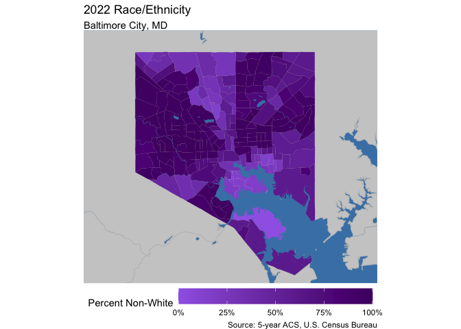
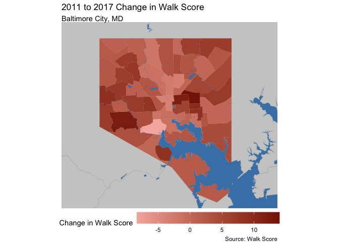
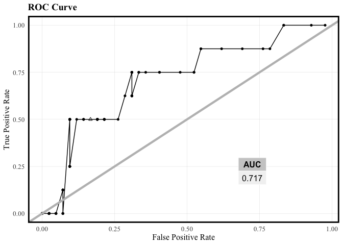

# Abstract

Defining and predicting gentrification is becoming more and more relevant to the average person as neighborhood residents become more concerned about getting priced out of their communities. Once something that could only be observed in hindsight, anticipating gentrification and attempting to prevent its disparate effects has become the subject of activism and counter-lobbying efforts. This report attempts to determine if gentrification can be correctly identified in Baltimore City, Maryland based on neighborhood characteristics that the average person can observe.


# About Baltimore City

Baltimore City, Maryland sits on the Patapsco River and is home to over 585,000 people (2020 Census). An incredibly historic city, though Baltimore was once full of rigorous industry, unbridled American patriotism, and wealth, its late 20th century reality was plagued by extreme disinvestment, high crime, and white flight.

::: {style="display: flex;"}

::: {}


<!-- --><!-- -->

:::

::: {}

<!-- --><!-- -->

:::

::::

Baltimore is less than an hour North of Annapolis, MD (the state capital) and Washington, DC as the crow drives. Baltimore/Washington International Airport (BWI) does not lie within Baltimore City boundaries.

# Defining Gentrification

Gentrification has many different definitions and connotations. At least part of its definition is intangible: often one can simply "feel" when a neighborhood has gentrified. At a glance, the clues may be found in the presence of new construction trying especially hard to look older, or in the manifestation of high-priced coffee shops and their hipster patrons where there were none before. 

The United States Department of Housing and Urban Development defines gentrification as, "a form of neighborhood change that occurs when high-income groups move to low-income areas, potentially altering the cultural and financial landscape of the original neighborhood”. 

Using this standard as a guide, we define our Gentrification Index per CT as follows:

<center> GI = (∆ High Income Proportion) + (Percent Change of Rent) + (Percent Change of Home Value) </center>

The change is calculated by subtracting the 2012 values from the 2022 values. The proportion of High Income residents per Census Tract is determined by tabulating the number of residents who make more than 80% of the AMI in Baltimore City alone during each given year. The change in Rent and Home Value were calculated based on median costs adjusted for inflation.

Once sorted in order of their Gentrification Index, we determine that the top 30th percentile of Census Tracts are extreme enough in their exhibition of the Index's ingredients to be labeled as "gentrified."


```r
#Getting population by Income numbers
bmore_ctmedhhinc12 <- get_acs(
  geography = "tract", 
  variables = c(tot = "B19001_001", 
                L = "B19001_002", L = "B19001_003", L = "B19001_004", L = "B19001_005", L = "B19001_006",
                H = "B19001_007", H = "B19001_008", H = "B19001_009", H = "B19001_010", H = "B19001_011", 
                H = "B19001_012", H = "B19001_013", H = "B19001_014", H = "B19001_015", H = "B19001_016", 
                H = "B19001_017"),
  state = "MD", 
  county = "Baltimore City",
  year = 2012,
  geometry = FALSE 
) %>%
  select(GEOID, variable, estimate) %>%
  rename(est12 = estimate, var12 = variable) %>%
  group_by(GEOID, var12) %>%
  summarise(est12 = sum(est12)) %>%
  pivot_wider(names_from = var12, values_from = est12) %>%
  mutate(percentHighInc12 = H/tot, percentLowInc12 = L/tot)

#adjusting for joined census tracts
changed_22Inc <- bmore_ctmedhhinc12 %>%
  filter(GEOID %in% c("24510180100", "24510180200")) %>%
  ungroup() %>%
  summarize(H = sum(H), L = sum(L), tot = sum(tot)) %>%
  mutate(percentHighInc12 = H / tot,
         percentLowInc12 = L / tot) %>%
  mutate(GEOID = "24510280600")

#joining info back to 2012
bmore_ctmedhhinc12 <- bmore_ctmedhhinc12 %>%
  ungroup()%>%
  filter(!(GEOID %in% c("24510180100", "24510180200"))) %>%
  bind_rows(changed_22Inc)

#getting HH income for 2022
bmore_ctmedhhinc22 <- get_acs(
  geography = "tract", 
  variables = c(tot = "B19001_001", 
                L = "B19001_002", L = "B19001_003", L = "B19001_004", L = "B19001_005", L = "B19001_006",
                L = "B19001_007", L = "B19001_008", L = "B19001_009", H = "B19001_010", H = "B19001_011", 
                H = "B19001_012", H = "B19001_013", H = "B19001_014", H = "B19001_015", H = "B19001_016", 
                H = "B19001_017"),
  state = "MD", 
  county = "Baltimore City",
  year = 2022,
  geometry = FALSE 
) %>%
  select(GEOID, variable, estimate) %>%
  rename(est22 = estimate, var22 = variable) %>%
  group_by(GEOID, var22) %>%
  summarise(est22 = sum(est22)) %>%
  pivot_wider(names_from = var22, values_from = est22) %>%
  mutate(percentHighInc22 = H/tot, percentLowInc22 = L/tot)
```


```r
all.acs.sf.g <- all.acs.sf %>%
  dplyr::select(GEOID, gentrify) %>%
  mutate(gentrify = as.factor(gentrify))

ggplot() +
  geom_sf(data = water_bound, fill = "steelblue") +
  geom_sf(data = md_bound, fill = "gray80", col = "gray75") +
  geom_sf(data = all.acs.sf, aes(fill = as.factor(gentrify)), col = "#756059") +
  scale_fill_manual(values = c("#5FA08F", "#F56A40"),
                    labels = c("No", "Yes")) +
  geom_sf(data = patapsco, fill = "steelblue", col = "transparent") +
  theme_void() +
  xlim(-76.75, -76.48) +
  ylim(39.2, 39.38) +
  theme(legend.position = "bottom", legend.key.width = unit(1.5, "cm")) +
  labs(fill = "Gentrified?",
       title = "2022 Gentrification per Census Tract",
       subtitle = "Baltimore City, MD")
```

<!-- -->


# Data Collection

For testing the ability to predict gentrification, input features that could be observed by eye were sourced, cleaned, and used in the model. Our data sources primarily included the 2012 and 2022 5-year ACS (American Community Survey) from the U.S. Census Bureau and Open Baltimore (<https://data.baltimorecity.gov/>).

The specific features pulled based on this criteria were:

_Baltimore City Open Bid List_
The Baltimore Bids feature includes city owned vacant lots and properties with vacant building notices. 

_Universities and Colleges_ 
The colleges feature includes the locations of universities and colleges in Baltimore. 

_Businesses_ 
The businesses feature contains the count of businesses in each community statistical area (CSA), which is a geographic measurement developed by the Baltimore City Planning Department to define neighborhood clusters. Ths model also includes a change in businesses feature, which accounts for the change in count of businesses per CSA from 2010 to 2019. 

_Vacant Lots_ 
The vacant lots feature includes the percentage of vacant lots per CSA. 

_Baltimore Schools_ 
The schools feature highlights the percentage of students per CSA who exceeded or met the Partnership for Assessment of Readiness for College and Careers (PARCC) math expectations. 

_Walk Score_
The walk score feature includes the average walk score by CSA and the change in walk score from 2017 to 2011.


::: {style="display: flex;"}

::: {}


```r
#change in walk score
ggplot() +
  geom_sf(data = water_bound, fill = "steelblue") +
  geom_sf(data = md_bound, fill = "gray80", col = "gray75") +
  geom_sf(data = walk_score_csa, aes(fill = changewalk), col = "transparent") +
  scale_fill_gradient(
    high = "#861D05",
    low = "#F5B5AC") +
  geom_sf(data = patapsco, fill = "steelblue", col = "transparent") +
  theme_void() +
  xlim(-76.75, -76.48) +
  ylim(39.2, 39.38) +
  theme(legend.position = "bottom", legend.key.width = unit(1.5, "cm")) +
  labs(fill = "Change in Walk Score",
       title = "2011 to 2017 Change in Walk Score",
       subtitle = "Baltimore City, MD")
```

<!-- -->

```r
#percent change in hosuing units
huchange <- all.acs.sf %>%
  dplyr::select(HUnitsPctChange, GEOID) %>%
  dplyr::mutate(HUnitsPctChange = HUnitsPctChange/100)

ggplot() +
  geom_sf(data = water_bound, fill = "steelblue") +
  geom_sf(data = md_bound, fill = "gray80", col = "gray75") +
  geom_sf(data = huchange, aes(fill = HUnitsPctChange), col = "transparent") +
  scale_fill_gradient(
    high = "#864259",
    low = "#F5A6C3", 
    labels = scales::percent) +
  geom_sf(data = patapsco, fill = "steelblue", col = "transparent") +
  theme_void() +
  xlim(-76.75, -76.48) +
  ylim(39.2, 39.38) +
  theme(legend.position = "bottom", legend.key.width = unit(1.5, "cm")) +
  labs(fill = "Percent Change",
       title = "2017 to 2022 Percent Change in Number of Housing Units",
       subtitle = "Baltimore City, MD")
```

<!-- -->

:::

::: {}


:::

::::

## Joining additional metrics


```r
p_load(nngeo,FNN,tibble, caret)

bmore_hoods <- bmore_p_lots %>%
  select(-p_vacant)

bmore_CSA_data <- bmore_p_lots %>%
  st_drop_geometry()%>%
  left_join(bmore_business)%>%
  st_as_sf()

bmore_CSA_data <- st_join(bmore_CSA_data, school_outcome, left = TRUE)%>%
  mutate(CSA = coalesce(CSA.x, CSA.y)) %>%
  select(-CSA.x, -CSA.y)%>%
mutate(across(everything(), ~replace_na(., 0)))

bmore_CSA_data <- st_join(bmore_CSA_data, walk_score, left = TRUE)%>%
  mutate(CSA = coalesce(CSA.x, CSA.y)) %>%
  select(-CSA.x, -CSA.y)%>%
mutate(across(everything(), ~replace_na(., 0)))

coldist <- baltimore_tracts
coldist$nearest_college_index <- st_nearest_feature(coldist, bmore_colleges)
coldist <- coldist %>%
  rowwise() %>%
  mutate(nearest_college = list(bmore_colleges[nearest_college_index, ]))
coldist <- coldist %>%
  mutate(coldist = st_distance(geometry, nearest_college$geometry))%>%
  select(-nearest_college_index,
         -nearest_college)%>%
  rename(collegedist = coldist)%>%
  st_drop_geometry()

acs.hoods <- all.acs.sf %>%
  st_transform(crs = st_crs(bmore_CSA_data))%>%
  st_centroid()%>%
  st_join(bmore_CSA_data, join = st_intersects)%>%
  mutate(NAME = coalesce(NAME.x, NAME.y)) %>%
  select(-NAME.x, -NAME.y)

acs.hoods <- acs.hoods %>%
  left_join(coldist)

acs.hoods <- acs.hoods %>%
  select(-STATEFP,
         -COUNTYFP,
         -TRACTCE,
         -NAMELSAD,
         -MTFCC,
         -FUNCSTAT,
         -ALAND,
         -AWATER,
         -INTPTLAT,
         -INTPTLON,
         -NAME) %>%
  st_drop_geometry()%>%
  left_join(bmore_bids)%>%
  mutate(across(where(is.numeric), ~replace_na(., 0)),
         across(where(is.character), ~replace_na(., "Unknown")))
```

# Model Development & Testing


```r
set.seed(678)

p_load(stargazer)

all.acs.reg <- acs.hoods 
all.acs.reg <- all.acs.reg %>%
  select(-(ends_with("22")),
         -(ends_with("12")),
         -genindex,
         -CSA,
         -RentPctChange,
         -HomeValuePctChange,
         -MedianRent17,
         -MedianHouseholdIncome17,
         -MedianRent22,
-BachelorsDegree17,
         -MedianHouseholdIncome22,
         -MedianHomeValue22,
         -MedianHouseholdIncome22,
         -percentHighInc22,
         -percentHighInc12,
         -WhiteAlone17,
         -GradProfessionalDegree17,
-MovedWithinCounty17,
         -MovedAbroad17,
         -OwnerOccupiedHouseholdSize17,
         -RenterOccupiedSize17,
         -MedianHomeValue17,
-DiffStateMovePct17,
-WhiteAlonePct17,
-AbroadMovePct17,
-collegedist,
-SStateMovePctChange,
         -inflation.adjHH17,
         -NonFamilyHouseholds17,
-VacantUnitsPctChange)%>%
mutate(walk_school = p_students * walk_score)%>%
mutate(business2 = changebiz ^2)%>%
mutate(upcoming = (changewalk * SStateMovePct17))%>%
select(-p_students,
-walk_score,
-changebiz,
-business_count,
-changewalk)

set.seed(777)

train <- all.acs.reg %>%
  sample_frac(.75)

train_index <- as.numeric(rownames(train))

test <- all.acs.reg[-train_index, ]

reg.gentrify <- glm(gentrify ~ ., data = 
                    train %>%
                      select(-GEOID,
                             -ChangeInLowIncPct,
                             -ChangeInHighIncPct),
                    family = "binomial"(link = "logit"))

stargazer(reg.gentrify, type = "text", out = "regression_summary.txt", title = "Regression Results", 
          label = "tab:regression_results", align = TRUE, 
          ci = TRUE, ci.level = 0.95, single.row = TRUE, 
          star.cutoffs = c(0.05, 0.01, 0.001), 
          notes = c("*** p<0.001", "** p<0.01", "* p<0.05"), 
          notes.align = "l", notes.label = "Significance levels:")
```

```
## 
## Regression Results
## =======================================================
##                                Dependent variable:     
##                           -----------------------------
##                                     gentrify           
## -------------------------------------------------------
## TotalPopulation17            -0.001 (-0.003, 0.001)    
## TotalHousingUnits17           0.001 (-0.002, 0.004)    
## VacantHousingUnits17         -0.001 (-0.008, 0.005)    
## MovedFromSameState17         -0.002 (-0.020, 0.016)    
## MovedFromDifferentState17    -0.003 (-0.014, 0.008)    
## FamilyHouseholds17            0.001 (-0.006, 0.008)    
## PopChangePct                 -0.021 (-0.081, 0.040)    
## HUnitsPctChange               0.084 (-0.004, 0.171)    
## IncPctChange                  0.013 (-0.008, 0.035)    
## GradPct17                    -0.069 (-0.209, 0.071)    
## CountyWWMovePct17             0.133* (0.005, 0.260)    
## SStateMovePct17              -0.077 (-0.659, 0.504)    
## BachelorsPct17                0.048 (-0.103, 0.198)    
## WhiteAlonePctChange           0.002 (-0.001, 0.004)    
## GradPctChange                 0.001 (-0.001, 0.003)    
## CountyWWMovePctChange         0.012* (0.001, 0.024)    
## DiffStateMovePctChange       0.002 (-0.0002, 0.004)    
## AbroadMovePctChange          -0.0003 (-0.002, 0.002)   
## BachelorsPctChange            0.002 (-0.008, 0.012)    
## OOSizePctChange              0.037* (0.0003, 0.073)    
## ROSizePctChange               0.008 (-0.026, 0.043)    
## FamHHPctChange               -0.010 (-0.032, 0.013)    
## NonFamHHPctChange            -0.018 (-0.051, 0.015)    
## p_vacant                      0.030 (-0.105, 0.165)    
## tractbids                    -0.058 (-0.147, 0.032)    
## walk_school                  -0.0002 (-0.001, 0.001)   
## business2                 -0.00000 (-0.00001, 0.00001) 
## upcoming                     -0.031 (-0.069, 0.007)    
## Constant                     -1.245 (-3.866, 1.377)    
## -------------------------------------------------------
## Observations                           149             
## Log Likelihood                       -57.145           
## Akaike Inf. Crit.                    172.291           
## =======================================================
## Significance levels:      *p<0.05; **p<0.01; ***p<0.001
##                           *** p<0.001                  
##                           ** p<0.01                    
##                           * p<0.05
```

The regression results reveal important insights into the factors influencing gentrification risk within the studied area. Among the predictors, MovedFromSameState17, IncPctChange, HUnitsPctChange, and OOSizePctChange stand out as statistically significant contributors to the likelihood of gentrification. These findings suggest that areas with an increase in housing units, owner-occupied household size, and income are more prone to gentrification pressures, which aligns with literature that has been conducted on the indicators of gentrification. Surprisingly, other features in the model do not demonstrate a significant relationship with gentrification risk, highlighting the nuanced nature of this phenomenon and limitations to predictive modeling.

The model's accuracy of 0.78 indicates that it correctly predicts gentrification status approximately 78% of the time, showcasing its potential utility in identifying at-risk neighborhoods. The sensitivity (true positive rate) and specificity (true negative rate) are reasonably balanced at 0.6154 and 0.8378, meaning the model is slightly better than chance at identifying true positives. 

Testing the outcomes.


Overall our model had accuracy of... and sensitivity of ....

This distinction between sensitivity and specificity is further illustrated by the probability distribution graph below. Here, we see that our model's predictions are concentrated around 0 for tracts with no gentrification. However, its predictions for tracts with gentrification are more spread out, signifying its lack of reliability in identifying true positives.


```r
p_load(ggplot2)
palette_4_colors <- c("#e4572e","#17bebb","#ffc914","#A379C9")
root.dir = "https://raw.githubusercontent.com/urbanSpatial/Public-Policy-Analytics-Landing/master/DATA/"
source("https://raw.githubusercontent.com/urbanSpatial/Public-Policy-Analytics-Landing/master/functions.r")

ggplot(testProbs, aes(x = probs, fill = as.factor(class))) + 
  geom_density() +
  facet_grid(class ~ .) +
  scale_fill_manual(values = palette_4_colors) + xlim(0, 1) +
  labs(x = "Gentrify", y = "Density of probabilities",
       title = "Distribution of predicted probabilities by observed outcome") +
  plotTheme() + theme(strip.text.x = element_text(size = 18),
        legend.position = "none")+
  theme(text = element_text(family = "Times New Roman", size = 12), 
        plot.title = element_text(face = "bold", size = 14),
        plot.subtitle = element_text(size = 12),
        plot.caption = element_text(size = 8))
```

<!-- -->
The higher peak to the left in the top chart indicates that the model is more confident in predicting non-gentrification instances (class 0) with lower probabilities (closer to 0). This suggests that there are clear features or patterns in the data that the model identifies as indicative of non-gentrification.

The more evenly distributed curve in the bottom chart suggests that the model's predicted probabilities for gentrification instances (class 1) are spread out across a wider range. The slight peak between 0.5 and 0.75 indicates that there are instances where the model predicts a moderate to high likelihood of gentrification, but with some variability.

Overall, these patterns highlight that the model has greater confidence identifying non-gentrification over gentrification. 

# Validation

More of the stuff. This time calling up a ROC curve.


```r
p_load(pROC)

iterateThresholds <- function(data, observedClass, predictedProbs) {
  observedClass <- enquo(observedClass)
  predictedProbs <- enquo(predictedProbs)
  
  x <- 0.01
  all_prediction <- data.frame()
  
  while (x <= 1) {
    this_prediction <- data %>%
      mutate(predclass = ifelse(!!predictedProbs > x, 1, 0)) %>%
      count(predclass, !!observedClass) %>%
      summarize(
        Count_TN = sum(n[predclass == 0 & !!observedClass == 0]),
        Count_TP = sum(n[predclass == 1 & !!observedClass == 1]),
        Count_FN = sum(n[predclass == 0 & !!observedClass == 1]),
        Count_FP = sum(n[predclass == 1 & !!observedClass == 0]),
        Rate_TP = Count_TP / (Count_TP + Count_FN),
        Rate_FP = Count_FP / (Count_FP + Count_TN),
        Rate_FN = Count_FN / (Count_FN + Count_TP),
        Rate_TN = Count_TN / (Count_TN + Count_FP),
        Accuracy = (Count_TP + Count_TN) / (Count_TP + Count_TN + Count_FN + Count_FP),
        Threshold = round(x, 2),
        .groups = 'drop'
      )
    
    all_prediction <- rbind(all_prediction, this_prediction)
    x <- x + .01
  }
  
  return(all_prediction)
}

testProbs.thresholds <- iterateThresholds(
  data = testProbs, 
  observedClass = class, 
  predictedProbs = probs
)

ggplot(testProbs.thresholds, aes(x = Threshold)) +
  geom_line(aes(y = Accuracy, color = "Accuracy")) +
  geom_line(aes(y = Rate_TP, color = "True Positive Rate")) +
  geom_line(aes(y = Rate_FP, color = "False Positive Rate")) +
  scale_color_manual(values = c("Accuracy" = "blue", "True Positive Rate" = "green", "False Positive Rate" = "red")) +
  labs(title = "Model Performance Across Different Percentile Cutoffs",
       x = "Percentile", y = "Rate") +
  theme_minimal() +
  theme(legend.title = element_blank(),
        legend.position = "bottom",
        text = element_text(family = "Times New Roman", size = 12),
        plot.title = element_text(face = "bold", size = 14),
        plot.subtitle = element_text(size = 12),
        plot.caption = element_text(size = 8))
```

<!-- -->

ROC curve


# Cross Validation


```r
acs.cv <- acs.hoods %>%
left_join(baltimore_tracts)%>%
  mutate(across(where(is.numeric), ~replace_na(., 0)),
         across(where(is.numeric), ~replace(., is.infinite(.), 0)))%>%
mutate(walk_school = p_students * walk_score,
business2 = changebiz ^2,
upcoming = (changewalk * SStateMovePct17))

reg.vars <- c("TotalPopulation17", "TotalHousingUnits17",
                      "VacantHousingUnits17", "MovedFromSameState17", "MovedFromDifferentState17",
                      "FamilyHouseholds17", "PopChangePct", "HUnitsPctChange",
                      "IncPctChange", "GradPct17", "CountyWWMovePct17",
                      "SStateMovePct17", "BachelorsPct17", "WhiteAlonePctChange",
                      "GradPctChange", "CountyWWMovePctChange", "DiffStateMovePctChange",
                      "AbroadMovePctChange", "BachelorsPctChange", "OOSizePctChange",
                      "ROSizePctChange", "FamHHPctChange", "NonFamHHPctChange",
                      "ChangeInHighIncPct", "ChangeInLowIncPct", "gentrify",
                      "p_vacant", "tractbids", "walk_school",
                      "business2", "upcoming")

reg.spatialCV <- crossValidate(
  dataset = acs.cv,
  id = "GEOID",
  dependentVariable = "gentrify",
  indVariables = reg.vars)%>%
select(GEOID, gentrify, Prediction)%>%
mutate(error = Prediction - gentrify)
```

```
## This hold out fold is 24510280301 
## This hold out fold is 24510240300 
## This hold out fold is 24510250101 
## This hold out fold is 24510250102 
## This hold out fold is 24510250103 
## This hold out fold is 24510250203 
## This hold out fold is 24510240400 
## This hold out fold is 24510250204 
## This hold out fold is 24510060300 
## This hold out fold is 24510260800 
## This hold out fold is 24510080800 
## This hold out fold is 24510260900 
## This hold out fold is 24510230200 
## This hold out fold is 24510270501 
## This hold out fold is 24510160200 
## This hold out fold is 24510100100 
## This hold out fold is 24510130300 
## This hold out fold is 24510060100 
## This hold out fold is 24510130805 
## This hold out fold is 24510160100 
## This hold out fold is 24510130200 
## This hold out fold is 24510130400 
## This hold out fold is 24510130600 
## This hold out fold is 24510130700 
## This hold out fold is 24510130803 
## This hold out fold is 24510130804 
## This hold out fold is 24510080301 
## This hold out fold is 24510250205 
## This hold out fold is 24510150100 
## This hold out fold is 24510090900 
## This hold out fold is 24510120400 
## This hold out fold is 24510270701 
## This hold out fold is 24510080700 
## This hold out fold is 24510010200 
## This hold out fold is 24510271801 
## This hold out fold is 24510150900 
## This hold out fold is 24510261000 
## This hold out fold is 24510260700 
## This hold out fold is 24510160300 
## This hold out fold is 24510060200 
## This hold out fold is 24510200702 
## This hold out fold is 24510260604 
## This hold out fold is 24510020300 
## This hold out fold is 24510280402 
## This hold out fold is 24510010100 
## This hold out fold is 24510010300 
## This hold out fold is 24510010400 
## This hold out fold is 24510010500 
## This hold out fold is 24510020100 
## This hold out fold is 24510020200 
## This hold out fold is 24510030100 
## This hold out fold is 24510160500 
## This hold out fold is 24510130806 
## This hold out fold is 24510140200 
## This hold out fold is 24510140300 
## This hold out fold is 24510150200 
## This hold out fold is 24510150300 
## This hold out fold is 24510150400 
## This hold out fold is 24510150500 
## This hold out fold is 24510150600 
## This hold out fold is 24510150701 
## This hold out fold is 24510150702 
## This hold out fold is 24510160600 
## This hold out fold is 24510271802 
## This hold out fold is 24510271900 
## This hold out fold is 24510151000 
## This hold out fold is 24510151100 
## This hold out fold is 24510150800 
## This hold out fold is 24510250206 
## This hold out fold is 24510250207 
## This hold out fold is 24510250301 
## This hold out fold is 24510250303 
## This hold out fold is 24510250401 
## This hold out fold is 24510250402 
## This hold out fold is 24510272003 
## This hold out fold is 24510280101 
## This hold out fold is 24510280102 
## This hold out fold is 24510280200 
## This hold out fold is 24510280302 
## This hold out fold is 24510030200 
## This hold out fold is 24510040100 
## This hold out fold is 24510040200 
## This hold out fold is 24510060400 
## This hold out fold is 24510070100 
## This hold out fold is 24510070200 
## This hold out fold is 24510070300 
## This hold out fold is 24510070400 
## This hold out fold is 24510250500 
## This hold out fold is 24510250600 
## This hold out fold is 24510260101 
## This hold out fold is 24510260102 
## This hold out fold is 24510260201 
## This hold out fold is 24510280401 
## This hold out fold is 24510280403 
## This hold out fold is 24510280404 
## This hold out fold is 24510080101 
## This hold out fold is 24510080102 
## This hold out fold is 24510080200 
## This hold out fold is 24510080302 
## This hold out fold is 24510080400 
## This hold out fold is 24510080500 
## This hold out fold is 24510080600 
## This hold out fold is 24510090100 
## This hold out fold is 24510120202 
## This hold out fold is 24510272005 
## This hold out fold is 24510120201 
## This hold out fold is 24510272004 
## This hold out fold is 24510272006 
## This hold out fold is 24510280500 
## This hold out fold is 24510260202 
## This hold out fold is 24510260203 
## This hold out fold is 24510260301 
## This hold out fold is 24510260302 
## This hold out fold is 24510260401 
## This hold out fold is 24510260403 
## This hold out fold is 24510260501 
## This hold out fold is 24510260303 
## This hold out fold is 24510090200 
## This hold out fold is 24510090300 
## This hold out fold is 24510090400 
## This hold out fold is 24510090500 
## This hold out fold is 24510090600 
## This hold out fold is 24510090700 
## This hold out fold is 24510260402 
## This hold out fold is 24510260404 
## This hold out fold is 24510090800 
## This hold out fold is 24510100200 
## This hold out fold is 24510100300 
## This hold out fold is 24510120100 
## This hold out fold is 24510110100 
## This hold out fold is 24510110200 
## This hold out fold is 24510120300 
## This hold out fold is 24510120500 
## This hold out fold is 24510120600 
## This hold out fold is 24510280600 
## This hold out fold is 24510260605 
## This hold out fold is 24510261100 
## This hold out fold is 24510270101 
## This hold out fold is 24510270102 
## This hold out fold is 24510270200 
## This hold out fold is 24510270301 
## This hold out fold is 24510270302 
## This hold out fold is 24510270600 
## This hold out fold is 24510270401 
## This hold out fold is 24510270402 
## This hold out fold is 24510270502 
## This hold out fold is 24510151200 
## This hold out fold is 24510151300 
## This hold out fold is 24510160400 
## This hold out fold is 24510160700 
## This hold out fold is 24510160801 
## This hold out fold is 24510160802 
## This hold out fold is 24510270702 
## This hold out fold is 24510270801 
## This hold out fold is 24510270703 
## This hold out fold is 24510270802 
## This hold out fold is 24510271400 
## This hold out fold is 24510271501 
## This hold out fold is 24510120700 
## This hold out fold is 24510130100 
## This hold out fold is 24510170100 
## This hold out fold is 24510170200 
## This hold out fold is 24510170300 
## This hold out fold is 24510190200 
## This hold out fold is 24510190300 
## This hold out fold is 24510200100 
## This hold out fold is 24510200200 
## This hold out fold is 24510200300 
## This hold out fold is 24510200400 
## This hold out fold is 24510270803 
## This hold out fold is 24510270805 
## This hold out fold is 24510270901 
## This hold out fold is 24510270902 
## This hold out fold is 24510270804 
## This hold out fold is 24510271503 
## This hold out fold is 24510180300 
## This hold out fold is 24510190100 
## This hold out fold is 24510200500 
## This hold out fold is 24510200600 
## This hold out fold is 24510200701 
## This hold out fold is 24510200800 
## This hold out fold is 24510270903 
## This hold out fold is 24510271001 
## This hold out fold is 24510271002 
## This hold out fold is 24510271101 
## This hold out fold is 24510271102 
## This hold out fold is 24510271200 
## This hold out fold is 24510271300 
## This hold out fold is 24510210100 
## This hold out fold is 24510220100 
## This hold out fold is 24510230300 
## This hold out fold is 24510240100 
## This hold out fold is 24510210200 
## This hold out fold is 24510240200 
## This hold out fold is 24510271600 
## This hold out fold is 24510271700 
## This hold out fold is 24510230100 
## This hold out fold is 24510140100 
## This hold out fold is 24510272007
```

```r
#tm_shape(reg.spatialCV)+
#tm_polygons(col = "Prediction")
```


```r
ggplot() +
  geom_sf(data = water_bound, fill = "steelblue") +
  geom_sf(data = md_bound, fill = "gray80", col = "gray75") +
  geom_sf(data = reg.spatialCV, aes(fill = Prediction), col = "transparent") +
  scale_fill_gradient(
    high = "#862805",
    low = "#EC9D1F") +
  geom_sf(data = patapsco, fill = "steelblue", col = "transparent") +
  theme_void() +
  xlim(-76.75, -76.48) +
  ylim(39.2, 39.38) +
  theme(legend.position = "bottom", legend.key.width = unit(1.5, "cm")) +
  labs(fill = "Gentrification Index",
       title = "Predicted Gentrification Index",
       subtitle = "Baltimore City, MD")
```

<!-- -->


# Conclusion

Measuring gentrification can be challenging, primarily due to the complexity of its definition. However, this model addresses this challenge by focusing on observable characteristics that the average resident can recognize. While advanced statistical models may have policy implications, the primary aim of this model is to empower city officials and residents to identify gentrification in their neighborhoods early on and take proactive steps to prevent displacement before it becomes a pressing issue.

The results of the model indicate…
