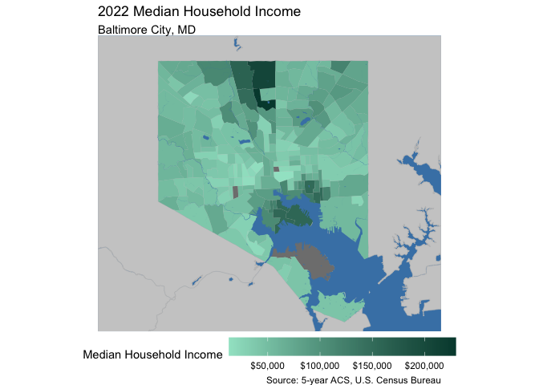
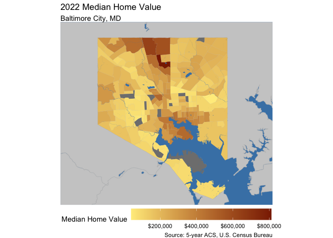
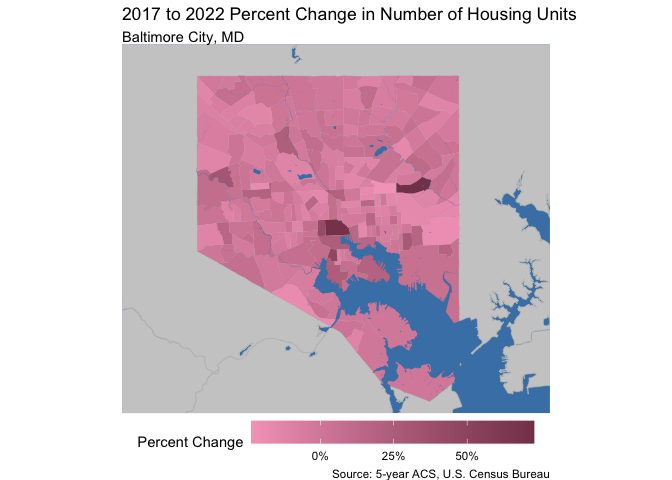
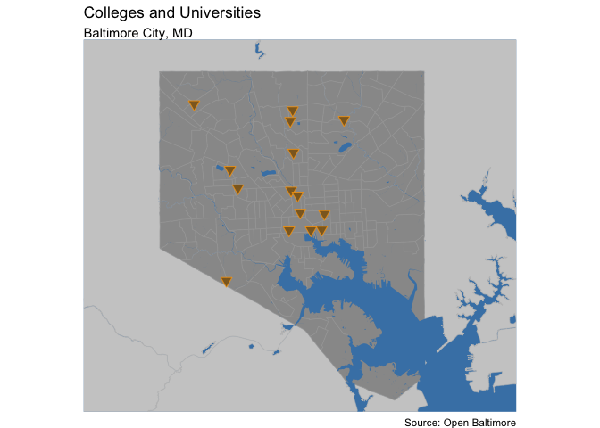
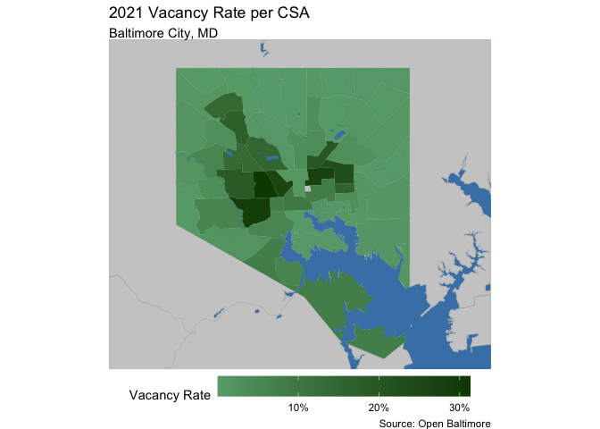

# Abstract

Defining and predicting gentrification is becoming more and more relevant to the average person as neighborhood residents become more concerned about getting priced out of their communities. Once something that could only be observed in hindsight, anticipating gentrification and attempting to prevent its disparate effects has become the subject of activism and counter-lobbying efforts. This report attempts to determine if gentrification can be correctly identified in Baltimore City, Maryland based on neighborhood characteristics that the average person can observe.


# About Baltimore City

Baltimore City, Maryland sits on the Patapsco River and is home to over 585,000 people (2020 Census). An incredibly historic city, though Baltimore was once full of rigorous industry, unbridled American patriotism, and wealth, its late 20th century reality was plagued by extreme disinvestment, high crime, and white flight.

Baltimore City is considered one of the most segregated cities in the United States, where neighborhoods are often predominantly white or predominantly Black and Hispanic. Coined, "The Butterfly Effect," the central spine running North-South is where communities are majority-white, have higher median incomes, and typically have lower health risks. The wings of Baltimore are where rents and home values are low and where more people of color live. 

::: {style="display: flex;"}

::: {}


<!-- --><!-- -->

:::

::: {}

<!-- --><!-- -->

:::

::::

Baltimore is less than an hour North of Annapolis, MD (the state capital) and Washington, DC as the crow drives. Baltimore/Washington International Airport (BWI) does not lie within Baltimore City boundaries.

# Defining Gentrification

Gentrification has many different definitions and connotations. At least part of its definition is intangible: often one can simply "feel" when a neighborhood has gentrified. At a glance, the clues may be found in the presence of new construction trying especially hard to look older, or in the manifestation of high-priced coffee shops and their hipster patrons where there were none before. 

The United States Department of Housing and Urban Development defines gentrification as, "a form of neighborhood change that occurs when high-income groups move to low-income areas, potentially altering the cultural and financial landscape of the original neighborhood”. 

Using this standard as a guide, we define our Gentrification Index per CT as follows:

<center> GI = (∆ High Income Proportion) + (Percent Change of Rent) + (Percent Change of Home Value) </center>

The change is calculated by subtracting the 2012 values from the 2022 values. The proportion of High Income residents per Census Tract is determined by tabulating the number of residents who make more than 80% of the AMI in Baltimore City alone during each given year. The change in Rent and Home Value were calculated based on median costs adjusted for inflation.

Once sorted in order of their Gentrification Index, we determine that the top 30th percentile of Census Tracts are extreme enough in their exhibition of the Index's ingredients to be labeled as "gentrified."


```r
#Getting population by Income numbers
bmore_ctmedhhinc12 <- get_acs(
  geography = "tract", 
  variables = c(tot = "B19001_001", 
                L = "B19001_002", L = "B19001_003", L = "B19001_004", L = "B19001_005", L = "B19001_006",
                H = "B19001_007", H = "B19001_008", H = "B19001_009", H = "B19001_010", H = "B19001_011", 
                H = "B19001_012", H = "B19001_013", H = "B19001_014", H = "B19001_015", H = "B19001_016", 
                H = "B19001_017"),
  state = "MD", 
  county = "Baltimore City",
  year = 2012,
  geometry = FALSE 
) %>%
  select(GEOID, variable, estimate) %>%
  rename(est12 = estimate, var12 = variable) %>%
  group_by(GEOID, var12) %>%
  summarise(est12 = sum(est12)) %>%
  pivot_wider(names_from = var12, values_from = est12) %>%
  mutate(percentHighInc12 = H/tot, percentLowInc12 = L/tot)

#adjusting for joined census tracts
changed_22Inc <- bmore_ctmedhhinc12 %>%
  filter(GEOID %in% c("24510180100", "24510180200")) %>%
  ungroup() %>%
  summarize(H = sum(H), L = sum(L), tot = sum(tot)) %>%
  mutate(percentHighInc12 = H / tot,
         percentLowInc12 = L / tot) %>%
  mutate(GEOID = "24510280600")

#joining info back to 2012
bmore_ctmedhhinc12 <- bmore_ctmedhhinc12 %>%
  ungroup()%>%
  filter(!(GEOID %in% c("24510180100", "24510180200"))) %>%
  bind_rows(changed_22Inc)

#getting HH income for 2022
bmore_ctmedhhinc22 <- get_acs(
  geography = "tract", 
  variables = c(tot = "B19001_001", 
                L = "B19001_002", L = "B19001_003", L = "B19001_004", L = "B19001_005", L = "B19001_006",
                L = "B19001_007", L = "B19001_008", L = "B19001_009", H = "B19001_010", H = "B19001_011", 
                H = "B19001_012", H = "B19001_013", H = "B19001_014", H = "B19001_015", H = "B19001_016", 
                H = "B19001_017"),
  state = "MD", 
  county = "Baltimore City",
  year = 2022,
  geometry = FALSE 
) %>%
  select(GEOID, variable, estimate) %>%
  rename(est22 = estimate, var22 = variable) %>%
  group_by(GEOID, var22) %>%
  summarise(est22 = sum(est22)) %>%
  pivot_wider(names_from = var22, values_from = est22) %>%
  mutate(percentHighInc22 = H/tot, percentLowInc22 = L/tot)
```


```r
all.acs.sf.g <- all.acs.sf %>%
  dplyr::select(GEOID, gentrify) %>%
  mutate(gentrify = as.factor(gentrify))

ggplot() +
  geom_sf(data = water_bound, fill = "steelblue") +
  geom_sf(data = md_bound, fill = "gray80", col = "gray75") +
  geom_sf(data = all.acs.sf, aes(fill = as.factor(gentrify)), col = "#756059") +
  scale_fill_manual(values = c("#5FA08F", "#F56A40"),
                    labels = c("No", "Yes")) +
  geom_sf(data = patapsco, fill = "steelblue", col = "transparent") +
  theme_void() +
  xlim(-76.75, -76.48) +
  ylim(39.2, 39.38) +
  theme(legend.position = "bottom", legend.key.width = unit(1.5, "cm")) +
  labs(fill = "Gentrified?",
       title = "2022 Gentrification per Census Tract",
       subtitle = "Baltimore City, MD")
```

<!-- -->


# Data Collection

For testing the ability to predict gentrification, input features that could be observed by eye were sourced, cleaned, and used in the model. Our data sources primarily included the 2012 and 2022 5-year ACS (American Community Survey) from the U.S. Census Bureau and Open Baltimore (<https://data.baltimorecity.gov/>).

The specific features pulled based on this criteria were:


_Baltimore City Open Bid List_

The Baltimore Bids feature includes the count of city owned vacant lots and properties with vacant building notices. 


_Universities and Colleges_ 

The colleges feature includes the locations of universities and colleges in Baltimore. 


_Businesses_ 

The businesses feature contains the count of businesses in each community statistical area (CSA), which is a geographic measurement developed by the Baltimore City Planning Department to define neighborhood clusters. Ths model also includes a change in businesses feature, which accounts for the change in count of businesses per CSA from 2010 to 2019. 


_Vacant Lots_ 

The vacant lots feature includes the percentage of residential properties which have been classifies as vacant or abandoned by the City of Baltimore per CSA. 


_Baltimore Schools_ 

The schools feature highlights the percentage of students per CSA who exceeded or met the Partnership for Assessment of Readiness for College and Careers (PARCC) math expectations. 


_Walk Score_

The walk score feature includes the average walk score by CSA and the change in walk score from 2017 to 2011.


:::: {style="display: flex;"}

::: {}


```r
#change in walk score
ggplot() +
  geom_sf(data = water_bound, fill = "steelblue") +
  geom_sf(data = md_bound, fill = "gray80", col = "gray75") +
  geom_sf(data = walk_score_csa, aes(fill = changewalk), col = "transparent") +
  scale_fill_gradient(
    high = "#861D05",
    low = "#F5B5AC") +
  geom_sf(data = patapsco, fill = "steelblue", col = "transparent") +
  theme_void() +
  xlim(-76.75, -76.48) +
  ylim(39.2, 39.38) +
  theme(legend.position = "bottom", legend.key.width = unit(1.5, "cm")) +
  labs(fill = "Change in Walk Score",
       title = "2011 to 2017 Change in Walk Score",
       subtitle = "Baltimore City, MD", 
       caption = "Source: Walk Score")
```

<!-- -->

```r
#percent change in housing units
huchange <- all.acs.sf %>%
  dplyr::select(HUnitsPctChange, GEOID) %>%
  dplyr::mutate(HUnitsPctChange = HUnitsPctChange/100)

ggplot() +
  geom_sf(data = water_bound, fill = "steelblue") +
  geom_sf(data = md_bound, fill = "gray80", col = "gray75") +
  geom_sf(data = huchange, aes(fill = HUnitsPctChange), col = "transparent") +
  scale_fill_gradient(
    high = "#864259",
    low = "#F5A6C3", 
    labels = scales::percent) +
  geom_sf(data = patapsco, fill = "steelblue", col = "transparent") +
  theme_void() +
  xlim(-76.75, -76.48) +
  ylim(39.2, 39.38) +
  theme(legend.position = "bottom", legend.key.width = unit(1.5, "cm")) +
  labs(fill = "Percent Change",
       title = "2017 to 2022 Percent Change in Number of Housing Units",
       subtitle = "Baltimore City, MD", 
       caption = "Source: 5-year ACS, U.S. Census Bureau")
```

<!-- -->

:::

::: {}


```r
#colleges

ggplot() +
  geom_sf(data = water_bound, fill = "steelblue") +
  geom_sf(data = md_bound, fill = "gray80", col = "gray75") +
  geom_sf(data = huchange, fill = "gray60", col = "gray65") +
  geom_sf(data = patapsco, fill = "steelblue", col = "transparent") +
  geom_sf(data = bmore_colleges, col = "orange", fill = "orange4", shape = 25, size = 3, alpha = 0.8) +
  theme_void() +
  xlim(-76.75, -76.48) +
  ylim(39.2, 39.38) +
  theme(legend.position = "none", legend.key.width = unit(1.5, "cm")) +
  labs(title = "Colleges and Universities",
       subtitle = "Baltimore City, MD", 
       caption = "Source: Open Baltimore")
```

<!-- -->

```r
#pcent vacant lots
bmore_p_lots_sf <- bmore_p_lots %>%
  dplyr::mutate(p_vacant = p_vacant/100)

ggplot() +
  geom_sf(data = water_bound, fill = "steelblue") +
  geom_sf(data = md_bound, fill = "gray80", col = "gray75") +
  geom_sf(data = bmore_p_lots_sf, aes(fill = p_vacant), col = "transparent") +
  scale_fill_gradient(
    high = "#0F4600",
    low = "#67A87A", 
    labels = scales::percent) +
  geom_sf(data = patapsco, fill = "steelblue", col = "transparent") +
  theme_void() +
  xlim(-76.75, -76.48) +
  ylim(39.2, 39.38) +
  theme(legend.position = "bottom", legend.key.width = unit(1.5, "cm")) +
  labs(fill = "Vacancy Rate",
       title = "2021 Vacancy Rate per CSA",
       subtitle = "Baltimore City, MD", 
       caption = "Source: Open Baltimore")
```

<!-- -->

:::

::::

## Logistic Regression


To predict gentrification, we will utilize a logistic regression model.

```r
set.seed(678)

p_load(stargazer)

all.acs.reg <- acs.hoods 
all.acs.reg <- all.acs.reg %>%
  select(-(ends_with("22")),
         -(ends_with("12")),
         -genindex,
         -CSA,
         -RentPctChange,
         -HomeValuePctChange,
         -MedianRent17,
         -MedianHouseholdIncome17,
         -MedianRent22,
-BachelorsDegree17,
         -MedianHouseholdIncome22,
         -MedianHomeValue22,
         -MedianHouseholdIncome22,
         -percentHighInc22,
         -percentHighInc12,
         -WhiteAlone17,
         -GradProfessionalDegree17,
-MovedWithinCounty17,
         -MovedAbroad17,
         -OwnerOccupiedHouseholdSize17,
         -RenterOccupiedSize17,
         -MedianHomeValue17,
-DiffStateMovePct17,
-WhiteAlonePct17,
-AbroadMovePct17,
-collegedist,
-SStateMovePctChange,
         -inflation.adjHH17,
         -NonFamilyHouseholds17,
-VacantUnitsPctChange)%>%
mutate(walk_school = p_students * walk_score)%>%
mutate(business2 = changebiz ^2)%>%
mutate(upcoming = (changewalk * SStateMovePct17))%>%
select(-p_students,
-walk_score,
-changebiz,
-business_count,
-changewalk)


train <- all.acs.reg %>%
  sample_frac(.75)

train_index <- as.numeric(rownames(train))

test <- all.acs.reg[-train_index, ]

reg.gentrify <- glm(gentrify ~ ., data = 
                    train %>%
                      select(-GEOID,
                             -ChangeInLowIncPct,
                             -ChangeInHighIncPct),
                    family = "binomial"(link = "logit"))

stargazer(reg.gentrify, type = "text", out = "regression_summary.txt", title = "Regression Results", 
          label = "tab:regression_results", align = TRUE, 
          ci = TRUE, ci.level = 0.95, single.row = TRUE, 
          star.cutoffs = c(0.05, 0.01, 0.001), 
          notes = c("*** p<0.001", "** p<0.01", "* p<0.05"), 
          notes.align = "l", notes.label = "Significance levels:")
```

```
## 
## Regression Results
## =======================================================
##                                Dependent variable:     
##                           -----------------------------
##                                     gentrify           
## -------------------------------------------------------
## TotalPopulation17            0.00005 (-0.002, 0.002)   
## TotalHousingUnits17          0.0001 (-0.003, 0.003)    
## VacantHousingUnits17          0.002 (-0.004, 0.008)    
## MovedFromSameState17        -0.020* (-0.039, -0.0004)  
## MovedFromDifferentState17    -0.003 (-0.013, 0.007)    
## FamilyHouseholds17            0.001 (-0.005, 0.007)    
## PopChangePct                 -0.011 (-0.064, 0.042)    
## HUnitsPctChange              0.123** (0.041, 0.205)    
## IncPctChange                  0.020 (-0.002, 0.043)    
## GradPct17                     0.002 (-0.120, 0.124)    
## CountyWWMovePct17            -0.013 (-0.132, 0.106)    
## SStateMovePct17               0.547 (-0.090, 1.185)    
## BachelorsPct17               -0.039 (-0.179, 0.102)    
## WhiteAlonePctChange          0.0004 (-0.001, 0.002)    
## GradPctChange                0.002* (0.0002, 0.005)    
## CountyWWMovePctChange        0.009 (-0.0004, 0.018)    
## DiffStateMovePctChange       0.00001 (-0.001, 0.001)   
## AbroadMovePctChange          -0.001 (-0.005, 0.003)    
## BachelorsPctChange            0.003 (-0.005, 0.010)    
## OOSizePctChange               0.035 (-0.002, 0.072)    
## ROSizePctChange               0.022 (-0.010, 0.053)    
## FamHHPctChange              -0.031* (-0.057, -0.005)   
## NonFamHHPctChange            -0.028 (-0.060, 0.003)    
## p_vacant                      0.048 (-0.052, 0.147)    
## tractbids                    -0.056 (-0.125, 0.014)    
## walk_school                  -0.0002 (-0.001, 0.001)   
## business2                  0.00000 (-0.00001, 0.00001) 
## upcoming                     -0.016 (-0.053, 0.021)    
## Constant                     -1.371 (-3.771, 1.029)    
## -------------------------------------------------------
## Observations                           149             
## Log Likelihood                       -62.009           
## Akaike Inf. Crit.                    182.018           
## =======================================================
## Significance levels:      *p<0.05; **p<0.01; ***p<0.001
##                           *** p<0.001                  
##                           ** p<0.01                    
##                           * p<0.05
```

The regression results reveal important insights into the factors influencing gentrification risk within the studied area. Among the predictors, MovedFromSameState17, IncPctChange, HUnitsPctChange, and OOSizePctChange stand out as statistically significant contributors to the likelihood of gentrification. These findings suggest that areas with an increase in housing units, owner-occupied household size, and income are more prone to gentrification pressures, which aligns with literature that has been conducted on the indicators of gentrification. Surprisingly, other features in the model do not demonstrate a significant relationship with gentrification risk, highlighting the nuanced nature of this phenomenon and limitations to predictive modeling.

The model's accuracy of 0.78 indicates that it correctly predicts gentrification status approximately 78% of the time, showcasing its potential utility in identifying at-risk neighborhoods. The sensitivity and specificity are reasonably balanced at 0.6154 and 0.8378, meaning the model is slightly better than chance at identifying true positives. 


```r
p_load(ggplot2)
palette_4_colors <- c("#e4572e","#17bebb","#ffc914","#A379C9")
root.dir = "https://raw.githubusercontent.com/urbanSpatial/Public-Policy-Analytics-Landing/master/DATA/"
source("https://raw.githubusercontent.com/urbanSpatial/Public-Policy-Analytics-Landing/master/functions.r")

ggplot(testProbs, aes(x = probs, fill = as.factor(class))) + 
  geom_density() +
  facet_grid(class ~ .) +
  scale_fill_manual(values = palette_4_colors) + xlim(0, 1) +
  labs(x = "Gentrify", y = "Density of probabilities",
       title = "Distribution of predicted probabilities by observed outcome") +
  plotTheme() + theme(strip.text.x = element_text(size = 18),
        legend.position = "none")+
  theme(text = element_text(family = "Times New Roman", size = 12), 
        plot.title = element_text(face = "bold", size = 14),
        plot.subtitle = element_text(size = 12),
        plot.caption = element_text(size = 8))
```

<!-- -->
The higher peak to the left in the top chart indicates that the model is more confident in predicting non-gentrification instances (class 0) with lower probabilities (closer to 0). This suggests that there are clear features or patterns in the data that the model identifies as indicative of non-gentrification.

The more evenly distributed curve in the bottom chart suggests that the model's predicted probabilities for gentrification instances (class 1) are spread out across a wider range. The slight peak between 0.5 and 0.75 indicates that there are instances where the model predicts a moderate to high likelihood of gentrification, but with some variability.

These patterns highlight that the model has greater confidence identifying non-gentrification over gentrification. 

## Model Performance

Overall, our model performs well in terms of predicting gentrification. Though the model is limited by the lack of observations, the ROC curve still has an AUC value of 0.761, underscoring that the model performs well across all thresholds.


The threshold performance curve further provides insights into the model's behavior. As shown in graph below, the accuracy, true positive rate (TPR), and false positive rate (FPR) vary with percentile cut off threshold use for creating our binary gentrification variable.

At lower percentiles, the model is more likely to classify tracts as gentrifying, which increases the TPR but also leads to a higher FPR. This indicates that while the model captures more tracts that do gentrify, it also generates more false positives. As the percentile increases, the TPR decreases while the FPR also decreases, meaning the model becomes more conservative in predicting gentrification, thus reducing the number of false positives but also missing some true positives.

For the purposes of this project, we focused on minimizing false positives, which led to our high cutoff percentile of 75%. However, in the future, this threshold can be adjusted to meet different objectives. For instance, our current model, with its high cutoff, is suitable for private developers looking to avoid investment in non-gentrifying neighborhoods. Conversely, if the model were to be used by a government agency to plan for rental assistance, the cutoff threshold would need to be lowered to reduce the risk of missing areas that might benefit from such programs.


```r
ggplot(testProbs.thresholds, aes(x = Threshold)) +
  geom_line(aes(y = Accuracy, color = "Accuracy")) +
  geom_line(aes(y = Rate_TP, color = "True Positive Rate")) +
  geom_line(aes(y = Rate_FP, color = "False Positive Rate")) +
  scale_color_manual(values = c("Accuracy" = "blue", "True Positive Rate" = "green", "False Positive Rate" = "red")) +
  labs(title = "Model Performance Across Different Percentile Cutoffs",
       x = "Percentile", y = "Rate") +
  theme_minimal() +
  theme(legend.title = element_blank(),
        legend.position = "bottom",
        text = element_text(family = "Times New Roman", size = 12),
        plot.title = element_text(face = "bold", size = 14),
        plot.subtitle = element_text(size = 12),
        plot.caption = element_text(size = 8))
```

<!-- -->

# Cross Validation

Overall, our model shows strong generalizability in predicting gentrification across different geographic regions. Running a Spatial Cross Validation finds our MAE to be 0.417, showing relative robustness across the different census tracts. This MAE is achieved after running k-fold spatial cross validation across all census tracts in the neighborhood, highlighting that overall, our model is relatively generalizable across space.


Looking at the geographic distribution of our MAE, we find that certain census tracts show higher MAE than another. This could be due to the implicit conditions present within these tracts that are not identified in the model. In the future, further research on Baltimore as well as its intra-tract variation could help decrease MAE across the city.


```r
ggplot() +
  geom_sf(data = water_bound, fill = "steelblue") +
  geom_sf(data = md_bound, fill = "gray80", col = "gray75") +
  geom_sf(data = reg.summary, aes(fill = Mean_Error), col = "transparent") +
  scale_fill_gradient(
    high = "#fb6f92",
    low = "#ffe5ec") +
  geom_sf(data = patapsco, fill = "steelblue", col = "transparent") +
  theme_void() +
  xlim(-76.75, -76.48) +
  ylim(39.2, 39.38) +
  theme(legend.position = "bottom", legend.key.width = unit(1.5, "cm")) +
  labs(fill = "MAE",
       title = "Mean Absolute Error by Census Tract",
       subtitle = "Baltimore City, MD")
```

<!-- -->


```r
ggplot() +
  geom_sf(data = water_bound, fill = "steelblue") +
  geom_sf(data = md_bound, fill = "gray80", col = "gray75") +
  geom_sf(data = reg.spatialCV, aes(fill = Prediction), col = "transparent") +
  scale_fill_gradient(
    high = "#862805",
    low = "#EC9D1F") +
  geom_sf(data = patapsco, fill = "steelblue", col = "transparent") +
  theme_void() +
  xlim(-76.75, -76.48) +
  ylim(39.2, 39.38) +
  theme(legend.position = "bottom", legend.key.width = unit(1.5, "cm")) +
  labs(fill = "Predicted GI",
       title = "Predicted Gentrification Index",
       subtitle = "Baltimore City, MD")
```

<!-- -->

Interestingly, some of the tracts with the highest MAE are also the tracts with the strongest predicted Gentrification Index, despite not being classified as gentrified by our threshold. These tracts generally seem to be neighboring actually gentrifying tracts. This discrepancy may be due to hidden spatial autocorrelation—tracts near other gentrifying tracts may experience similar forces, though not at the same scale. This spatial spillover effect suggests that while these tracts do not meet the gentrification threshold, they are influenced by nearby gentrification activities, which our model captures. In the future, we would be interested in accounting for these spatial autocorrelations.


# Conclusion

Measuring gentrification can be challenging, primarily due to the complexity of its definition. However, this model addresses this challenge by focusing on observable characteristics that the average resident can recognize. While advanced statistical models may have policy implications, the primary aim of this model is to empower city officials and residents to identify gentrification in their neighborhoods early on and take proactive steps to prevent displacement before it becomes a pressing issue.

The results of the model indicate factors such as increased housing units, larger owner-occupied household sizes, and income growth correlate with a greater risk of gentrification in Baltimore City, Maryland. These insights align with the literature on gentrification and most of these changes could be observed by the average resident.  

The model's accuracy rate of 78% highlights its potential use as a tool to identify at-risk neighborhoods. Currently, it excels more in predicting indicators that an area is not undergoing gentrification, however, fine-tuning the model with adjusted thresholds could lead to a more cohesive and accurate prediction of areas at risk. While the model could use further refinement, it serves as an initial step towards providing insights into visible indicators of gentrification for city officials and local residents to empower communities and curb displacement. 


