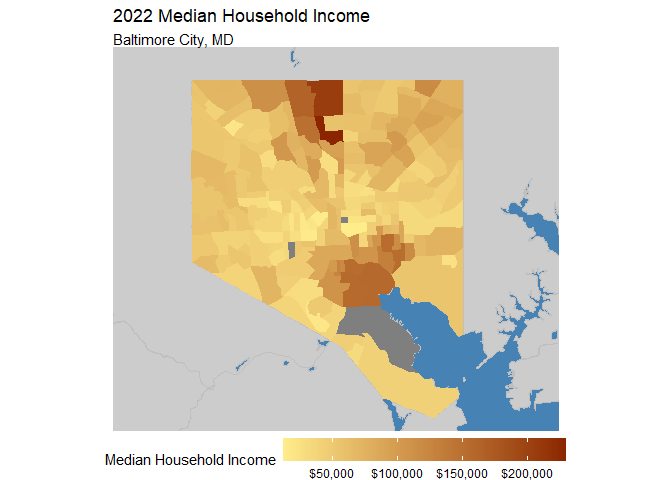
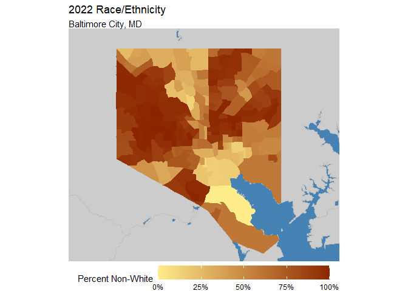
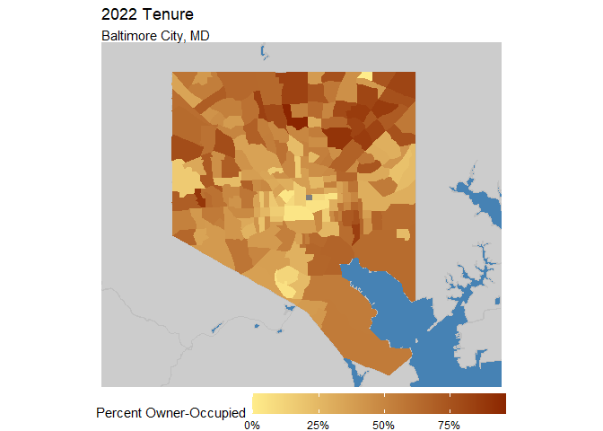

Now we are working on getting our gentrification index. First, we want to calculate the percentage of low and high income people for census tracts in both years.


```r
#Getting population by Income numbers
bmore_ctmedhhinc12 <- get_acs(
  geography = "tract", 
  variables = c(tot = "B19001_001", 
                L = "B19001_002", L = "B19001_003", L = "B19001_004", L = "B19001_005", L = "B19001_006",
                H = "B19001_007", H = "B19001_008", H = "B19001_009", H = "B19001_010", H = "B19001_011", 
                H = "B19001_012", H = "B19001_013", H = "B19001_014", H = "B19001_015", H = "B19001_016", 
                H = "B19001_017"),
  state = "MD", 
  county = "Baltimore City",
  year = 2012,
  geometry = FALSE 
) %>%
  select(GEOID, variable, estimate) %>%
  rename(est12 = estimate, var12 = variable) %>%
  group_by(GEOID, var12) %>%
  summarise(est12 = sum(est12)) %>%
  pivot_wider(names_from = var12, values_from = est12) %>%
  mutate(percentHighInc12 = H/tot, percentLowInc12 = L/tot)
```

```
## Getting data from the 2008-2012 5-year ACS
```

```
## `summarise()` has grouped output by 'GEOID'. You can override using the
## `.groups` argument.
```

```r
#adjusting for joined census tracts
changed_22Inc <- bmore_ctmedhhinc12 %>%
  filter(GEOID %in% c("24510180100", "24510180200")) %>%
  ungroup() %>%
  summarize(H = sum(H), L = sum(L), tot = sum(tot)) %>%
  mutate(percentHighInc12 = H / tot,
         percentLowInc12 = L / tot) %>%
  mutate(GEOID = "24510280600")

#joining info back to 2012
bmore_ctmedhhinc12 <- bmore_ctmedhhinc12 %>%
  ungroup()%>%
  filter(!(GEOID %in% c("24510180100", "24510180200"))) %>%
  bind_rows(changed_22Inc)

#getting HH income for 2022
bmore_ctmedhhinc22 <- get_acs(
  geography = "tract", 
  variables = c(tot = "B19001_001", 
                L = "B19001_002", L = "B19001_003", L = "B19001_004", L = "B19001_005", L = "B19001_006",
                L = "B19001_007", L = "B19001_008", L = "B19001_009", H = "B19001_010", H = "B19001_011", 
                H = "B19001_012", H = "B19001_013", H = "B19001_014", H = "B19001_015", H = "B19001_016", 
                H = "B19001_017"),
  state = "MD", 
  county = "Baltimore City",
  year = 2022,
  geometry = FALSE 
) %>%
  select(GEOID, variable, estimate) %>%
  rename(est22 = estimate, var22 = variable) %>%
  group_by(GEOID, var22) %>%
  summarise(est22 = sum(est22)) %>%
  pivot_wider(names_from = var22, values_from = est22) %>%
  mutate(percentHighInc22 = H/tot, percentLowInc22 = L/tot)
```

```
## Getting data from the 2018-2022 5-year ACS
## `summarise()` has grouped output by 'GEOID'. You can override using the `.groups` argument.
```
Now that the data is ready getting it in my index


```r
#joining all
bmore_hhinc_change <- left_join(bmore_ctmedhhinc12, bmore_ctmedhhinc22, by = "GEOID") %>%
  select(GEOID, percentHighInc12, percentHighInc22, percentLowInc12, percentLowInc22)

#creating my final dataset
all.acs <- left_join(all.acs, bmore_hhinc_change)%>%
  mutate(ChangeInHighIncPct = (percentHighInc22 - percentHighInc12),
         ChangeInLowIncPct = (percentLowInc22 - percentLowInc12))
```

```
## Joining with `by = join_by(GEOID)`
```

```r
#getting my index
all.acs <- all.acs %>%
  mutate(
    NHHIncChangeper = HHIncChangeper / max(abs(HHIncChangeper), na.rm = TRUE),
    NChangeInHighIncPct = ChangeInHighIncPct / max(abs(ChangeInHighIncPct), na.rm = TRUE),
    NChangeInLowIncPct = ChangeInLowIncPct / max(abs(ChangeInLowIncPct), na.rm = TRUE)
  )%>%
  mutate(genindex = NChangeInHighIncPct - (NChangeInLowIncPct))%>%
  mutate(gentrify = case_when((genindex > (quantile(all.acs$genindex, 0.75, na.rm = TRUE)))~ 1,
         TRUE ~ 0))
```

```
## Warning: There was 1 warning in `mutate()`.
## ℹ In argument: `gentrify = case_when(...)`.
## Caused by warning:
## ! Unknown or uninitialised column: `genindex`.
```
Now joining to Shape file


```r
baltimore_tracts <- tracts(state = "MD", county = "Baltimore City", year = 2022)
all.acs.sf <- left_join(baltimore_tracts, all.acs, by = "GEOID")

tm_shape(all.acs.sf)+
  tm_polygons(fill = "gentrify")
```

```
## The visual variable "fill" of the layer "polygons" contains a unique value. Therefore a discrete scale is applied (tm_scale_discrete).
```

<!-- -->


```r
#Vacant lots 
bmore_lots <- st_read("https://egisdata.baltimorecity.gov/egis/rest/services/Housing/DHCD_Open_Baltimore_Datasets/FeatureServer/1/query?outFields=*&where=1%3D1&f=geojson")
```

```
## Reading layer `OGRGeoJSON' from data source 
##   `https://egisdata.baltimorecity.gov/egis/rest/services/Housing/DHCD_Open_Baltimore_Datasets/FeatureServer/1/query?outFields=*&where=1%3D1&f=geojson' 
##   using driver `GeoJSON'
## Simple feature collection with 13420 features and 12 fields
## Geometry type: POINT
## Dimension:     XY
## Bounding box:  xmin: -76.71109 ymin: 39.22065 xmax: -76.53058 ymax: 39.37191
## Geodetic CRS:  WGS 84
```

```r
bmore_lots$DateNotice <- as.POSIXct(bmore_lots$DateNotice, format = "%Y-%m-%d %H:%M:%S")

#Open-Bid List - Vacants to Value 
bmore_bids <- st_read("https://egisdata.baltimorecity.gov/egis/rest/services/Housing/DHCD_Open_Baltimore_Datasets/FeatureServer/7/query?outFields=*&where=1%3D1&f=geojson")
```

```
## Reading layer `OGRGeoJSON' from data source 
##   `https://egisdata.baltimorecity.gov/egis/rest/services/Housing/DHCD_Open_Baltimore_Datasets/FeatureServer/7/query?outFields=*&where=1%3D1&f=geojson' 
##   using driver `GeoJSON'
## Simple feature collection with 1205 features and 10 fields
## Geometry type: POINT
## Dimension:     XY
## Bounding box:  xmin: -76.68734 ymin: 39.23272 xmax: -76.55044 ymax: 39.37046
## Geodetic CRS:  WGS 84
```

```r
#Universities & colleges? 
bmore_colleges <- st_read("https://services1.arcgis.com/UWYHeuuJISiGmgXx/arcgis/rest/services/Universities_and_Colleges/FeatureServer/0/query?outFields=*&where=1%3D1&f=geojson")
```

```
## Reading layer `OGRGeoJSON' from data source 
##   `https://services1.arcgis.com/UWYHeuuJISiGmgXx/arcgis/rest/services/Universities_and_Colleges/FeatureServer/0/query?outFields=*&where=1%3D1&f=geojson' 
##   using driver `GeoJSON'
## Simple feature collection with 15 features and 5 fields
## Geometry type: POINT
## Dimension:     XY
## Bounding box:  xmin: -76.68769 ymin: 39.26072 xmax: -76.58476 ymax: 39.35473
## Geodetic CRS:  WGS 84
```

```r
#Businesses by community statistical areas 
bmore_business <- st_read("https://services1.arcgis.com/mVFRs7NF4iFitgbY/arcgis/rest/services/Neiind/FeatureServer/0/query?outFields=*&where=1%3D1&f=geojson")
```

```
## Reading layer `OGRGeoJSON' from data source 
##   `https://services1.arcgis.com/mVFRs7NF4iFitgbY/arcgis/rest/services/Neiind/FeatureServer/0/query?outFields=*&where=1%3D1&f=geojson' 
##   using driver `GeoJSON'
## Simple feature collection with 55 features and 17 fields
## Geometry type: MULTIPOLYGON
## Dimension:     XY
## Bounding box:  xmin: -76.71141 ymin: 39.19724 xmax: -76.52968 ymax: 39.37201
## Geodetic CRS:  WGS 84
```

```r
#Percentage of vacant lots 
bmore_p_lots <- st_read("https://services1.arcgis.com/mVFRs7NF4iFitgbY/arcgis/rest/services/Vacant/FeatureServer/0/query?outFields=*&where=1%3D1&f=geojson")
```

```
## Reading layer `OGRGeoJSON' from data source 
##   `https://services1.arcgis.com/mVFRs7NF4iFitgbY/arcgis/rest/services/Vacant/FeatureServer/0/query?outFields=*&where=1%3D1&f=geojson' 
##   using driver `GeoJSON'
## Simple feature collection with 55 features and 17 fields
## Geometry type: MULTIPOLYGON
## Dimension:     XY
## Bounding box:  xmin: -76.71141 ymin: 39.19724 xmax: -76.52968 ymax: 39.37201
## Geodetic CRS:  WGS 84
```

```r
#Note to self (Tina) - make new combined features file 


#Baltimore schools

school_outcome <- st_read("https://services1.arcgis.com/mVFRs7NF4iFitgbY/arcgis/rest/services/Pread3/FeatureServer/0/query?outFields=*&where=1%3D1&f=geojson")
```

```
## Reading layer `OGRGeoJSON' from data source 
##   `https://services1.arcgis.com/mVFRs7NF4iFitgbY/arcgis/rest/services/Pread3/FeatureServer/0/query?outFields=*&where=1%3D1&f=geojson' 
##   using driver `GeoJSON'
## Simple feature collection with 55 features and 7 fields
## Geometry type: MULTIPOLYGON
## Dimension:     XY
## Bounding box:  xmin: -76.71141 ymin: 39.19724 xmax: -76.52968 ymax: 39.37201
## Geodetic CRS:  WGS 84
```

## Visualization


```r
#2022 Median Household Income
bmore_hhinc22 <- get_acs(
  geography = "tract", 
  variables = "B19013_001",
  state = "MD", 
  county = "Baltimore City",
  year = 2022,
  geometry = TRUE 
) %>%
  select(GEOID, estimate)

#2022 Majority Non-White
bmore_nonwhite22 <- get_acs(
  geography = "tract", 
  variables = c(tot = "B03002_001", white = "B03002_003"),
  state = "MD", 
  county = "Baltimore City",
  year = 2022,
  geometry = TRUE
) %>%
  select(GEOID, variable, estimate) %>%
  pivot_wider(names_from = variable, values_from = estimate) %>%
  mutate(nonwhite = 1 - (white/tot))

#2022 Majority Owner
bmore_pcentoo22 <- get_acs(
  geography = "tract", 
  variables = c(tot = "B25003_001", oo = "B25003_002", ro = "B25003_003"),
  state = "MD", 
  county = "Baltimore City",
  year = 2022,
  geometry = TRUE
) %>%
  select(GEOID, variable, estimate) %>%
  pivot_wider(names_from = variable, values_from = estimate) %>%
  mutate(propoo = (oo/tot))

#2022 Median Home Value
bmore_hv22 <- get_acs(
  geography = "tract", 
  variables = "B25077_001",
  state = "MD", 
  county = "Baltimore City",
  year = 2022,
  geometry = TRUE 
) %>%
  select(GEOID, estimate)

#2022 Median Rent
```


```r
#2022 Median Household Income
ggplot() +
  geom_sf(data = water_bound, fill = "steelblue") +
  geom_sf(data = md_bound, fill = "gray80", col = "gray75") +
  geom_sf(data = bmore_hhinc22, aes(fill = estimate), col = "transparent") +
  scale_fill_gradient(
    high = "orangered4",
    low = "lightgoldenrod1",
    labels = scales::dollar) +
  theme_void() +
  xlim(-76.75, -76.48) +
  ylim(39.2, 39.38) +
  theme(legend.position = "bottom", legend.key.width = unit(1.5, "cm")) +
  labs(fill = "Median Household Income",
       title = "2022 Median Household Income",
       subtitle = "Baltimore City, MD")
```

<!-- -->

```r
#2022 Majority Non-White
ggplot() +
  geom_sf(data = water_bound, fill = "steelblue") +
  geom_sf(data = md_bound, fill = "gray80", col = "gray75") +
  geom_sf(data = bmore_nonwhite22, aes(fill = nonwhite), col = "transparent") +
  scale_fill_gradient(
    high = "orangered4",
    low = "lightgoldenrod1",
    labels = scales::percent) +
  theme_void() +
  xlim(-76.75, -76.48) +
  ylim(39.2, 39.38) +
  theme(legend.position = "bottom", legend.key.width = unit(1.5, "cm")) +
  labs(fill = "Percent Non-White",
       title = "2022 Race/Ethnicity",
       subtitle = "Baltimore City, MD")
```

<!-- -->

```r
#2022 Majority Owner
ggplot() +
  geom_sf(data = water_bound, fill = "steelblue") +
  geom_sf(data = md_bound, fill = "gray80", col = "gray75") +
  geom_sf(data = bmore_pcentoo22, aes(fill = propoo), col = "transparent") +
  scale_fill_gradient(
    high = "orangered4",
    low = "lightgoldenrod1",
    labels = scales::percent) +
  theme_void() +
  xlim(-76.75, -76.48) +
  ylim(39.2, 39.38) +
  theme(legend.position = "bottom", legend.key.width = unit(1.5, "cm")) +
  labs(fill = "Percent Owner-Occupied",
       title = "2022 Tenure",
       subtitle = "Baltimore City, MD")
```

<!-- -->

```r
#2022 Median Home Value
ggplot() +
  geom_sf(data = water_bound, fill = "steelblue") +
  geom_sf(data = md_bound, fill = "gray80", col = "gray75") +
  geom_sf(data = bmore_hv22, aes(fill = estimate), col = "transparent") +
  scale_fill_gradient(
    high = "orangered4",
    low = "lightgoldenrod1",
    labels = scales::dollar) +
  theme_void() +
  xlim(-76.75, -76.48) +
  ylim(39.2, 39.38) +
  theme(legend.position = "bottom", legend.key.width = unit(1.5, "cm")) +
  labs(fill = "Median Home Value",
       title = "2022 Median Home Value",
       subtitle = "Baltimore City, MD")
```

<!-- -->

```r
#2022 Median Rent
```


## Moving to Modelling

```r
p_load(stargazer)

all.acs12 <- all.acs %>%
  select(GEOID, gentrify, ends_with("12"))

train <- all.acs12 %>%
  sample_frac(.75)

train_index <- as.numeric(rownames(train))

test <- all.acs12[-train_index, ]

reg.gentrify <- glm(gentrify ~ ., data = 
                    train %>%
                      select(-GEOID),
                    family = "binomial"(link = "logit"))

stargazer(reg.gentrify, type = "text", out = "regression_summary.txt", title = "Regression Results", 
          label = "tab:regression_results", align = TRUE, 
          ci = TRUE, ci.level = 0.95, single.row = TRUE, 
          star.cutoffs = c(0.05, 0.01, 0.001), 
          notes = c("*** p<0.001", "** p<0.01", "* p<0.05"), 
          notes.align = "l", notes.label = "Significance levels:")
```

```
## 
## Regression Results
## ================================================================
##                                      Dependent variable:        
##                              -----------------------------------
##                                           gentrify              
## ----------------------------------------------------------------
## TotalPopulation12                 0.000 (-223.391, 223.391)     
## TotalHousingUnits12              -0.000 (-427.200, 427.200)     
## VacantHousingUnits12              0.000 (-606.183, 606.183)     
## MedianHouseholdIncome12             0.000 (-8.185, 8.185)       
## WhiteAlone12                       0.000 (-98.405, 98.405)      
## GradProfessionalDegree12          0.000 (-401.005, 401.005)     
## MovedWithinCounty12               0.000 (-376.483, 376.483)     
## MovedFromSameState12             -0.000 (-810.602, 810.602)     
## MovedFromDifferentState12        -0.000 (-878.033, 878.033)     
## MovedAbroad12                  -0.000 (-1,480.522, 1,480.522)   
## BachelorsDegree12                -0.000 (-571.998, 571.998)     
## OwnerOccupiedHouseholdSize12 -0.000 (-128,187.900, 128,187.900) 
## RenterOccupiedSize12         -0.000 (-138,445.600, 138,445.600) 
## FamilyHouseholds12               -0.000 (-767.082, 767.082)     
## NonFamilyHouseholds12                                           
## MedianRent12                      0.000 (-369.134, 369.134)     
## MedianHomeValue12                  -0.000 (-1.319, 1.319)       
## inflation.adjHH12                                               
## percentHighInc12              0.000 (-783,479.100, 783,479.100) 
## percentLowInc12                                                 
## Constant                     -26.566 (-652,764.700, 652,711.500)
## ----------------------------------------------------------------
## Observations                                 146                
## Log Likelihood                             -0.000               
## Akaike Inf. Crit.                          36.000               
## ================================================================
## Significance levels:         *p<0.05; **p<0.01; ***p<0.001      
##                              *** p<0.001                        
##                              ** p<0.01                          
##                              * p<0.05
```

Testing the outcomes. 


```r
testProbs <- 
  data.frame(class = test$gentrify,
             probs = predict(reg.gentrify, test, type = "response"))

testProbs %>%
  mutate(predClass = ifelse(probs >= .5, "1", "0"), 
         predClass = factor(predClass, levels = c("0", "1")),  
         class = factor(class, levels = c("0", "1"))) %>% 
  { caret::confusionMatrix(.$predClass, .$class, positive = "1") }
```

```
## Confusion Matrix and Statistics
## 
##           Reference
## Prediction  0  1
##          0 50  0
##          1  0  0
##                                      
##                Accuracy : 1          
##                  95% CI : (0.9289, 1)
##     No Information Rate : 1          
##     P-Value [Acc > NIR] : 1          
##                                      
##                   Kappa : NaN        
##                                      
##  Mcnemar's Test P-Value : NA         
##                                      
##             Sensitivity : NA         
##             Specificity :  1         
##          Pos Pred Value : NA         
##          Neg Pred Value : NA         
##              Prevalence :  0         
##          Detection Rate :  0         
##    Detection Prevalence :  0         
##       Balanced Accuracy : NA         
##                                      
##        'Positive' Class : 1          
## 
```

More stuff


```r
p_load(ggplot2)
palette_4_colors <- c("#e4572e","#17bebb","#ffc914","#A379C9")
root.dir = "https://raw.githubusercontent.com/urbanSpatial/Public-Policy-Analytics-Landing/master/DATA/"
source("https://raw.githubusercontent.com/urbanSpatial/Public-Policy-Analytics-Landing/master/functions.r")

ggplot(testProbs, aes(x = probs, fill = as.factor(class))) + 
  geom_density() +
  facet_grid(class ~ .) +
  scale_fill_manual(values = palette_4_colors) + xlim(0, 1) +
  labs(x = "Gentrify", y = "Density of probabilities",
       title = "Distribution of predicted probabilities by observed outcome") +
  plotTheme() + theme(strip.text.x = element_text(size = 18),
        legend.position = "none")+
  theme(text = element_text(family = "Times New Roman", size = 12), 
        plot.title = element_text(face = "bold", size = 14),
        plot.subtitle = element_text(size = 12),
        plot.caption = element_text(size = 8))
```

<!-- -->

More of the stuff. This time calling up a ROC curve. 


```r
p_load(pROC)

iterateThresholds <- function(data, observedClass, predictedProbs) {
  observedClass <- enquo(observedClass)
  predictedProbs <- enquo(predictedProbs)
  
  x <- 0.01
  all_prediction <- data.frame()
  
  while (x <= 1) {
    this_prediction <- data %>%
      mutate(predclass = ifelse(!!predictedProbs > x, 1, 0)) %>%
      count(predclass, !!observedClass) %>%
      summarize(
        Count_TN = sum(n[predclass == 0 & !!observedClass == 0]),
        Count_TP = sum(n[predclass == 1 & !!observedClass == 1]),
        Count_FN = sum(n[predclass == 0 & !!observedClass == 1]),
        Count_FP = sum(n[predclass == 1 & !!observedClass == 0]),
        Rate_TP = Count_TP / (Count_TP + Count_FN),
        Rate_FP = Count_FP / (Count_FP + Count_TN),
        Rate_FN = Count_FN / (Count_FN + Count_TP),
        Rate_TN = Count_TN / (Count_TN + Count_FP),
        Accuracy = (Count_TP + Count_TN) / (Count_TP + Count_TN + Count_FN + Count_FP),
        Threshold = round(x, 2),
        .groups = 'drop'
      )
    
    all_prediction <- rbind(all_prediction, this_prediction)
    x <- x + .01
  }
  
  return(all_prediction)
}

testProbs.thresholds <- iterateThresholds(
  data = testProbs, 
  observedClass = class, 
  predictedProbs = probs
)

ggplot(testProbs.thresholds, aes(x = Threshold)) +
  geom_line(aes(y = Accuracy, color = "Accuracy")) +
  geom_line(aes(y = Rate_TP, color = "True Positive Rate")) +
  geom_line(aes(y = Rate_FP, color = "False Positive Rate")) +
  scale_color_manual(values = c("Accuracy" = "blue", "True Positive Rate" = "green", "False Positive Rate" = "red")) +
  labs(title = "Model Performance Across Different Thresholds",
       x = "Threshold", y = "Rate") +
  theme_minimal() +
  theme(legend.title = element_blank(),
        legend.position = "bottom",
        text = element_text(family = "Times New Roman", size = 12),
        plot.title = element_text(face = "bold", size = 14),
        plot.subtitle = element_text(size = 12),
        plot.caption = element_text(size = 8))
```

<!-- -->

ROC curve


