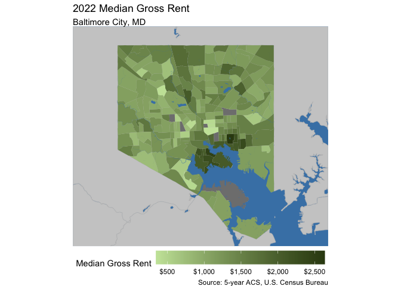

# Abstract
Defining and predicting gentrification is becoming more and more relevant to the average person as neighborhood residents become more concerned about getting priced out of their communities. Once something that could only be observed in hindsight, anticipating gentrification and attempting to prevent its disparate effects has become the subject of activism and counter-lobbying efforts. This report attempts to determine if gentrification can be correctly identified in Baltimore City, Maryland based on neighborhood characteristics that the average person can observe.


# About Baltimore City
Baltimore City, Maryland sits on the Patapsco River and is home to over 585,000 people (2020 Census). An incredibly historic city, though Baltimore was once full of rigorous industry, unbridled American patriotism, and wealth, its late 20th century reality was plagued by extreme disinvestment, high crime, and white flight.


```r
#2022 Median Household Income
bmore_hhinc22 <- get_acs(
  geography = "tract", 
  variables = "B19013_001",
  state = "MD", 
  county = "Baltimore City",
  year = 2022,
  geometry = TRUE 
) %>%
  select(GEOID, estimate)
```

```
## Getting data from the 2018-2022 5-year ACS
```

```r
#2022 Majority Non-White
bmore_nonwhite22 <- get_acs(
  geography = "tract", 
  variables = c(tot = "B03002_001", white = "B03002_003"),
  state = "MD", 
  county = "Baltimore City",
  year = 2022,
  geometry = TRUE
) %>%
  select(GEOID, variable, estimate) %>%
  pivot_wider(names_from = variable, values_from = estimate) %>%
  mutate(nonwhite = 1 - (white/tot))
```

```
## Getting data from the 2018-2022 5-year ACS
```

```r
#2022 Majority Owner
bmore_pcentoo22 <- get_acs(
  geography = "tract", 
  variables = c(tot = "B25003_001", oo = "B25003_002", ro = "B25003_003"),
  state = "MD", 
  county = "Baltimore City",
  year = 2022,
  geometry = TRUE
) %>%
  select(GEOID, variable, estimate) %>%
  pivot_wider(names_from = variable, values_from = estimate) %>%
  mutate(propoo = (oo/tot))
```

```
## Getting data from the 2018-2022 5-year ACS
```

```r
#2022 Median Home Value
bmore_hv22 <- get_acs(
  geography = "tract", 
  variables = "B25077_001",
  state = "MD", 
  county = "Baltimore City",
  year = 2022,
  geometry = TRUE 
) %>%
  select(GEOID, estimate)
```

```
## Getting data from the 2018-2022 5-year ACS
```

```r
#2022 Median Rent
bmore_rent22 <- get_acs(
  geography = "tract", 
  variables = "B25031_001",
  state = "MD", 
  county = "Baltimore City",
  year = 2022,
  geometry = TRUE 
) %>%
  select(GEOID, estimate)
```

```
## Getting data from the 2018-2022 5-year ACS
```

:::: {style="display: flex;"}

::: {}


```r
#2022 Median Household Income
ggplot() +
  geom_sf(data = water_bound, fill = "steelblue") +
  geom_sf(data = md_bound, fill = "gray80", col = "gray75") +
  geom_sf(data = bmore_hhinc22, aes(fill = estimate), col = "transparent") +
  scale_fill_gradient(
    high = "#00473B",
    low = "#A1E4CC",
    labels = scales::dollar) +
  theme_void() +
  xlim(-76.75, -76.48) +
  ylim(39.2, 39.38) +
  theme(legend.position = "bottom", legend.key.width = unit(1.5, "cm")) +
  labs(fill = "Median Household Income",
       title = "2022 Median Household Income",
       subtitle = "Baltimore City, MD")
```

<!-- -->

```r
#2022 Median Home Value
ggplot() +
  geom_sf(data = water_bound, fill = "steelblue") +
  geom_sf(data = md_bound, fill = "gray80", col = "gray75") +
  geom_sf(data = bmore_hv22, aes(fill = estimate), col = "transparent") +
  scale_fill_gradient(
    high = "orangered4",
    low = "lightgoldenrod1",
    labels = scales::dollar) +
  theme_void() +
  xlim(-76.75, -76.48) +
  ylim(39.2, 39.38) +
  theme(legend.position = "bottom", legend.key.width = unit(1.5, "cm")) +
  labs(fill = "Median Home Value",
       title = "2022 Median Home Value",
       subtitle = "Baltimore City, MD")
```

<!-- -->

:::

::: {}


```r
#2022 Majority Non-White
ggplot() +
  geom_sf(data = water_bound, fill = "steelblue") +
  geom_sf(data = md_bound, fill = "gray80", col = "gray75") +
  geom_sf(data = bmore_nonwhite22, aes(fill = nonwhite), col = "transparent") +
  scale_fill_gradient(
    high = "#4F0070",
    low = "#A169E6",
    labels = scales::percent) +
  theme_void() +
  xlim(-76.75, -76.48) +
  ylim(39.2, 39.38) +
  theme(legend.position = "bottom", legend.key.width = unit(1.5, "cm")) +
  labs(fill = "Percent Non-White",
       title = "2022 Race/Ethnicity",
       subtitle = "Baltimore City, MD")
```

<!-- -->

```r
#2022 Median Rent
ggplot() +
  geom_sf(data = water_bound, fill = "steelblue") +
  geom_sf(data = md_bound, fill = "gray80", col = "gray75") +
  geom_sf(data = bmore_rent22, aes(fill = estimate), col = "transparent") +
  scale_fill_gradient(
    high = "#344713",
    low = "#C9E5A8",
    labels = scales::dollar) +
  theme_void() +
  xlim(-76.75, -76.48) +
  ylim(39.2, 39.38) +
  theme(legend.position = "bottom", legend.key.width = unit(1.5, "cm")) +
  labs(fill = "Median Gross Rent",
       title = "2022 Median Gross Rent",
       subtitle = "Baltimore City, MD")
```

<!-- -->

```r
#2022 Majority Owner
ggplot() +
  geom_sf(data = water_bound, fill = "steelblue") +
  geom_sf(data = md_bound, fill = "gray80", col = "gray75") +
  geom_sf(data = bmore_pcentoo22, aes(fill = propoo), col = "transparent") +
  scale_fill_gradient(
    high = "#1E1670",
    low = "#628CE5",
    labels = scales::percent) +
  theme_void() +
  xlim(-76.75, -76.48) +
  ylim(39.2, 39.38) +
  theme(legend.position = "bottom", legend.key.width = unit(1.5, "cm")) +
  labs(fill = "Percent Owner-Occupied",
       title = "2022 Tenure",
       subtitle = "Baltimore City, MD")
```

<!-- -->

:::

::::

Baltimore is less than an hour North of Annapolis, MD (the state capital) and Washington, DC as the crow drives. Baltimore/Washington International Airport (BWI) does not lie within Baltimore City boundaries.

misplaced below?


```r
#Getting population by Income numbers
bmore_ctmedhhinc12 <- get_acs(
  geography = "tract", 
  variables = c(tot = "B19001_001", 
                L = "B19001_002", L = "B19001_003", L = "B19001_004", L = "B19001_005", L = "B19001_006",
                H = "B19001_007", H = "B19001_008", H = "B19001_009", H = "B19001_010", H = "B19001_011", 
                H = "B19001_012", H = "B19001_013", H = "B19001_014", H = "B19001_015", H = "B19001_016", 
                H = "B19001_017"),
  state = "MD", 
  county = "Baltimore City",
  year = 2012,
  geometry = FALSE 
) %>%
  select(GEOID, variable, estimate) %>%
  rename(est12 = estimate, var12 = variable) %>%
  group_by(GEOID, var12) %>%
  summarise(est12 = sum(est12)) %>%
  pivot_wider(names_from = var12, values_from = est12) %>%
  mutate(percentHighInc12 = H/tot, percentLowInc12 = L/tot)
```

```
## Getting data from the 2008-2012 5-year ACS
```

```
## `summarise()` has grouped output by 'GEOID'. You can override using the
## `.groups` argument.
```

```r
#adjusting for joined census tracts
changed_22Inc <- bmore_ctmedhhinc12 %>%
  filter(GEOID %in% c("24510180100", "24510180200")) %>%
  ungroup() %>%
  summarize(H = sum(H), L = sum(L), tot = sum(tot)) %>%
  mutate(percentHighInc12 = H / tot,
         percentLowInc12 = L / tot) %>%
  mutate(GEOID = "24510280600")

#joining info back to 2012
bmore_ctmedhhinc12 <- bmore_ctmedhhinc12 %>%
  ungroup()%>%
  filter(!(GEOID %in% c("24510180100", "24510180200"))) %>%
  bind_rows(changed_22Inc)

#getting HH income for 2022
bmore_ctmedhhinc22 <- get_acs(
  geography = "tract", 
  variables = c(tot = "B19001_001", 
                L = "B19001_002", L = "B19001_003", L = "B19001_004", L = "B19001_005", L = "B19001_006",
                L = "B19001_007", L = "B19001_008", L = "B19001_009", H = "B19001_010", H = "B19001_011", 
                H = "B19001_012", H = "B19001_013", H = "B19001_014", H = "B19001_015", H = "B19001_016", 
                H = "B19001_017"),
  state = "MD", 
  county = "Baltimore City",
  year = 2022,
  geometry = FALSE 
) %>%
  select(GEOID, variable, estimate) %>%
  rename(est22 = estimate, var22 = variable) %>%
  group_by(GEOID, var22) %>%
  summarise(est22 = sum(est22)) %>%
  pivot_wider(names_from = var22, values_from = est22) %>%
  mutate(percentHighInc22 = H/tot, percentLowInc22 = L/tot)
```

```
## Getting data from the 2018-2022 5-year ACS
## `summarise()` has grouped output by 'GEOID'. You can override using the `.groups` argument.
```


```r
#Open-Bid List - Vacants to Value 
bmore_bids <- st_read("https://egisdata.baltimorecity.gov/egis/rest/services/Housing/DHCD_Open_Baltimore_Datasets/FeatureServer/7/query?outFields=*&where=1%3D1&f=geojson")
```

```
## Reading layer `OGRGeoJSON' from data source 
##   `https://egisdata.baltimorecity.gov/egis/rest/services/Housing/DHCD_Open_Baltimore_Datasets/FeatureServer/7/query?outFields=*&where=1%3D1&f=geojson' 
##   using driver `GeoJSON'
## Simple feature collection with 1205 features and 10 fields
## Geometry type: POINT
## Dimension:     XY
## Bounding box:  xmin: -76.68734 ymin: 39.23272 xmax: -76.55044 ymax: 39.37046
## Geodetic CRS:  WGS 84
```

```r
#Universities & colleges? 
bmore_colleges <- st_read("https://services1.arcgis.com/UWYHeuuJISiGmgXx/arcgis/rest/services/Universities_and_Colleges/FeatureServer/0/query?outFields=*&where=1%3D1&f=geojson")
```

```
## Reading layer `OGRGeoJSON' from data source 
##   `https://services1.arcgis.com/UWYHeuuJISiGmgXx/arcgis/rest/services/Universities_and_Colleges/FeatureServer/0/query?outFields=*&where=1%3D1&f=geojson' 
##   using driver `GeoJSON'
## Simple feature collection with 15 features and 5 fields
## Geometry type: POINT
## Dimension:     XY
## Bounding box:  xmin: -76.68769 ymin: 39.26072 xmax: -76.58476 ymax: 39.35473
## Geodetic CRS:  WGS 84
```

```r
#Businesses by community statistical areas 
bmore_business <- st_read("https://services1.arcgis.com/mVFRs7NF4iFitgbY/arcgis/rest/services/Neiind/FeatureServer/0/query?outFields=*&where=1%3D1&f=geojson")
```

```
## Reading layer `OGRGeoJSON' from data source 
##   `https://services1.arcgis.com/mVFRs7NF4iFitgbY/arcgis/rest/services/Neiind/FeatureServer/0/query?outFields=*&where=1%3D1&f=geojson' 
##   using driver `GeoJSON'
## Simple feature collection with 55 features and 17 fields
## Geometry type: MULTIPOLYGON
## Dimension:     XY
## Bounding box:  xmin: -76.71141 ymin: 39.19724 xmax: -76.52968 ymax: 39.37201
## Geodetic CRS:  WGS 84
```

```r
#Percentage of vacant lots 
bmore_p_lots <- st_read("https://services1.arcgis.com/mVFRs7NF4iFitgbY/arcgis/rest/services/Vacant/FeatureServer/0/query?outFields=*&where=1%3D1&f=geojson")
```

```
## Reading layer `OGRGeoJSON' from data source 
##   `https://services1.arcgis.com/mVFRs7NF4iFitgbY/arcgis/rest/services/Vacant/FeatureServer/0/query?outFields=*&where=1%3D1&f=geojson' 
##   using driver `GeoJSON'
## Simple feature collection with 55 features and 17 fields
## Geometry type: MULTIPOLYGON
## Dimension:     XY
## Bounding box:  xmin: -76.71141 ymin: 39.19724 xmax: -76.52968 ymax: 39.37201
## Geodetic CRS:  WGS 84
```

```r
#Baltimore schools

school_outcome <- st_read("https://services1.arcgis.com/mVFRs7NF4iFitgbY/arcgis/rest/services/Pread3/FeatureServer/0/query?outFields=*&where=1%3D1&f=geojson")
```

```
## Reading layer `OGRGeoJSON' from data source 
##   `https://services1.arcgis.com/mVFRs7NF4iFitgbY/arcgis/rest/services/Pread3/FeatureServer/0/query?outFields=*&where=1%3D1&f=geojson' 
##   using driver `GeoJSON'
## Simple feature collection with 55 features and 7 fields
## Geometry type: MULTIPOLYGON
## Dimension:     XY
## Bounding box:  xmin: -76.71141 ymin: 39.19724 xmax: -76.52968 ymax: 39.37201
## Geodetic CRS:  WGS 84
```

```r
#walk score
walk_score <- st_read("https://services1.arcgis.com/mVFRs7NF4iFitgbY/arcgis/rest/services/Wlksc/FeatureServer/0/query?outFields=*&where=1%3D1&f=geojson")
```

```
## Reading layer `OGRGeoJSON' from data source 
##   `https://services1.arcgis.com/mVFRs7NF4iFitgbY/arcgis/rest/services/Wlksc/FeatureServer/0/query?outFields=*&where=1%3D1&f=geojson' 
##   using driver `GeoJSON'
## Simple feature collection with 55 features and 6 fields
## Geometry type: MULTIPOLYGON
## Dimension:     XY
## Bounding box:  xmin: -76.71141 ymin: 39.19724 xmax: -76.52968 ymax: 39.37201
## Geodetic CRS:  WGS 84
```


misplaced above?

# Defining Gentrification
We define our Gentrification Index per CT as [ (∆ High Income Proportion) - (∆Low Income Proportion) ]. The change is calculated by subtracting the 2012 values from the 2022 values. If the change in proportion of high income residents is below 1, and the change in proportion of low income residents is above 1, then the equation would result in a negative number and would indicate that more poor residents have “moved” in - and would not indicate the occurrence of gentrification. If the change in proportion of high income residents is above 1, and the change in proportion of low income residents is below 1, then the equation would result in a positive number and would indicate that more wealthy residents have “moved” in - a key indicator of gentrification. 


```r
#Getting population by Income numbers
bmore_ctmedhhinc12 <- get_acs(
  geography = "tract", 
  variables = c(tot = "B19001_001", 
                L = "B19001_002", L = "B19001_003", L = "B19001_004", L = "B19001_005", L = "B19001_006",
                H = "B19001_007", H = "B19001_008", H = "B19001_009", H = "B19001_010", H = "B19001_011", 
                H = "B19001_012", H = "B19001_013", H = "B19001_014", H = "B19001_015", H = "B19001_016", 
                H = "B19001_017"),
  state = "MD", 
  county = "Baltimore City",
  year = 2012,
  geometry = FALSE 
) %>%
  select(GEOID, variable, estimate) %>%
  rename(est12 = estimate, var12 = variable) %>%
  group_by(GEOID, var12) %>%
  summarise(est12 = sum(est12)) %>%
  pivot_wider(names_from = var12, values_from = est12) %>%
  mutate(percentHighInc12 = H/tot, percentLowInc12 = L/tot)
```

```
## Getting data from the 2008-2012 5-year ACS
```

```
## `summarise()` has grouped output by 'GEOID'. You can override using the
## `.groups` argument.
```

```r
#adjusting for joined census tracts
changed_22Inc <- bmore_ctmedhhinc12 %>%
  filter(GEOID %in% c("24510180100", "24510180200")) %>%
  ungroup() %>%
  summarize(H = sum(H), L = sum(L), tot = sum(tot)) %>%
  mutate(percentHighInc12 = H / tot,
         percentLowInc12 = L / tot) %>%
  mutate(GEOID = "24510280600")

#joining info back to 2012
bmore_ctmedhhinc12 <- bmore_ctmedhhinc12 %>%
  ungroup()%>%
  filter(!(GEOID %in% c("24510180100", "24510180200"))) %>%
  bind_rows(changed_22Inc)

#getting HH income for 2022
bmore_ctmedhhinc22 <- get_acs(
  geography = "tract", 
  variables = c(tot = "B19001_001", 
                L = "B19001_002", L = "B19001_003", L = "B19001_004", L = "B19001_005", L = "B19001_006",
                L = "B19001_007", L = "B19001_008", L = "B19001_009", H = "B19001_010", H = "B19001_011", 
                H = "B19001_012", H = "B19001_013", H = "B19001_014", H = "B19001_015", H = "B19001_016", 
                H = "B19001_017"),
  state = "MD", 
  county = "Baltimore City",
  year = 2022,
  geometry = FALSE 
) %>%
  select(GEOID, variable, estimate) %>%
  rename(est22 = estimate, var22 = variable) %>%
  group_by(GEOID, var22) %>%
  summarise(est22 = sum(est22)) %>%
  pivot_wider(names_from = var22, values_from = est22) %>%
  mutate(percentHighInc22 = H/tot, percentLowInc22 = L/tot)
```

```
## Getting data from the 2018-2022 5-year ACS
## `summarise()` has grouped output by 'GEOID'. You can override using the `.groups` argument.
```


```r
#joining all
bmore_hhinc_change <- left_join(bmore_ctmedhhinc12, bmore_ctmedhhinc22, by = "GEOID") %>%
  select(GEOID, percentHighInc12, percentHighInc22, percentLowInc12, percentLowInc22)

#creating my final dataset
all.acs <- left_join(all.acs, bmore_hhinc_change)%>%
  mutate(ChangeInHighIncPct = (percentHighInc22 - percentHighInc12),
         ChangeInLowIncPct = (percentLowInc22 - percentLowInc12))
```

```
## Joining with `by = join_by(GEOID)`
```

```r
all.acs <- all.acs%>%
  mutate(genindex = ChangeInHighIncPct + abs(ChangeInLowIncPct))%>%
  mutate(gentrify = case_when((genindex > (quantile(all.acs$genindex, 0.70, na.rm = TRUE)))~ 1,
         TRUE ~ 0))
```

```
## Warning: There was 1 warning in `mutate()`.
## ℹ In argument: `gentrify = case_when(...)`.
## Caused by warning:
## ! Unknown or uninitialised column: `genindex`.
```


```r
baltimore_tracts <- tracts(state = "MD", county = "Baltimore City", year = 2022)
all.acs.sf <- left_join(baltimore_tracts, all.acs, by = "GEOID")

tm_shape(all.acs.sf)+
  tm_polygons(fill = "gentrify")
```

```
## The visual variable "fill" of the layer "polygons" contains a unique value. Therefore a discrete scale is applied (tm_scale_discrete).
```

<!-- -->

# Data Collection
Our data sources primarily included the 2012 and 2022 5-year ACS (American Community Survey) from the U.S. Census Bureau and Open Baltimore (https://data.baltimorecity.gov/). 


```r
#Open-Bid List - Vacants to Value 
bmore_bids <- st_read("https://egisdata.baltimorecity.gov/egis/rest/services/Housing/DHCD_Open_Baltimore_Datasets/FeatureServer/7/query?outFields=*&where=1%3D1&f=geojson")
```

```
## Reading layer `OGRGeoJSON' from data source 
##   `https://egisdata.baltimorecity.gov/egis/rest/services/Housing/DHCD_Open_Baltimore_Datasets/FeatureServer/7/query?outFields=*&where=1%3D1&f=geojson' 
##   using driver `GeoJSON'
## Simple feature collection with 1205 features and 10 fields
## Geometry type: POINT
## Dimension:     XY
## Bounding box:  xmin: -76.68734 ymin: 39.23272 xmax: -76.55044 ymax: 39.37046
## Geodetic CRS:  WGS 84
```

```r
#Universities & colleges? 
bmore_colleges <- st_read("https://services1.arcgis.com/UWYHeuuJISiGmgXx/arcgis/rest/services/Universities_and_Colleges/FeatureServer/0/query?outFields=*&where=1%3D1&f=geojson")
```

```
## Reading layer `OGRGeoJSON' from data source 
##   `https://services1.arcgis.com/UWYHeuuJISiGmgXx/arcgis/rest/services/Universities_and_Colleges/FeatureServer/0/query?outFields=*&where=1%3D1&f=geojson' 
##   using driver `GeoJSON'
## Simple feature collection with 15 features and 5 fields
## Geometry type: POINT
## Dimension:     XY
## Bounding box:  xmin: -76.68769 ymin: 39.26072 xmax: -76.58476 ymax: 39.35473
## Geodetic CRS:  WGS 84
```

```r
#Businesses by community statistical areas 
bmore_business <- st_read("https://services1.arcgis.com/mVFRs7NF4iFitgbY/arcgis/rest/services/Neiind/FeatureServer/0/query?outFields=*&where=1%3D1&f=geojson")
```

```
## Reading layer `OGRGeoJSON' from data source 
##   `https://services1.arcgis.com/mVFRs7NF4iFitgbY/arcgis/rest/services/Neiind/FeatureServer/0/query?outFields=*&where=1%3D1&f=geojson' 
##   using driver `GeoJSON'
## Simple feature collection with 55 features and 17 fields
## Geometry type: MULTIPOLYGON
## Dimension:     XY
## Bounding box:  xmin: -76.71141 ymin: 39.19724 xmax: -76.52968 ymax: 39.37201
## Geodetic CRS:  WGS 84
```

```r
#Percentage of vacant lots 
bmore_p_lots <- st_read("https://services1.arcgis.com/mVFRs7NF4iFitgbY/arcgis/rest/services/Vacant/FeatureServer/0/query?outFields=*&where=1%3D1&f=geojson")
```

```
## Reading layer `OGRGeoJSON' from data source 
##   `https://services1.arcgis.com/mVFRs7NF4iFitgbY/arcgis/rest/services/Vacant/FeatureServer/0/query?outFields=*&where=1%3D1&f=geojson' 
##   using driver `GeoJSON'
## Simple feature collection with 55 features and 17 fields
## Geometry type: MULTIPOLYGON
## Dimension:     XY
## Bounding box:  xmin: -76.71141 ymin: 39.19724 xmax: -76.52968 ymax: 39.37201
## Geodetic CRS:  WGS 84
```

```r
#Note to self (Tina) - make new combined features file 


#Baltimore schools

school_outcome <- st_read("https://services1.arcgis.com/mVFRs7NF4iFitgbY/arcgis/rest/services/Pread3/FeatureServer/0/query?outFields=*&where=1%3D1&f=geojson")
```

```
## Reading layer `OGRGeoJSON' from data source 
##   `https://services1.arcgis.com/mVFRs7NF4iFitgbY/arcgis/rest/services/Pread3/FeatureServer/0/query?outFields=*&where=1%3D1&f=geojson' 
##   using driver `GeoJSON'
## Simple feature collection with 55 features and 7 fields
## Geometry type: MULTIPOLYGON
## Dimension:     XY
## Bounding box:  xmin: -76.71141 ymin: 39.19724 xmax: -76.52968 ymax: 39.37201
## Geodetic CRS:  WGS 84
```

```r
#walk score
walk_score <- st_read("https://services1.arcgis.com/mVFRs7NF4iFitgbY/arcgis/rest/services/Wlksc/FeatureServer/0/query?outFields=*&where=1%3D1&f=geojson")
```

```
## Reading layer `OGRGeoJSON' from data source 
##   `https://services1.arcgis.com/mVFRs7NF4iFitgbY/arcgis/rest/services/Wlksc/FeatureServer/0/query?outFields=*&where=1%3D1&f=geojson' 
##   using driver `GeoJSON'
## Simple feature collection with 55 features and 6 fields
## Geometry type: MULTIPOLYGON
## Dimension:     XY
## Bounding box:  xmin: -76.71141 ymin: 39.19724 xmax: -76.52968 ymax: 39.37201
## Geodetic CRS:  WGS 84
```


```r
#percentage of vacant lots 
bmore_p_lots <- bmore_p_lots %>%
  select(CSA2020, vacant21, geometry) %>%
  rename(CSA = CSA2020, 
         p_vacant = vacant21)

#number of businesses 
bmore_business <- bmore_business %>%
  select(CSA2020, neiind21, geometry) %>%
  rename(CSA = CSA2020, 
         business_count = neiind21)

#percentage of 3rd grade students who met math test target 
school_outcome <- school_outcome %>%
  select(CSA2010, pread317, geometry) %>%
  rename(CSA = CSA2010,
         p_students = pread317)

#walk score
walk_score <- walk_score %>%
  select(CSA2010, wlksc17, geometry) %>%
  rename(CSA = CSA2010,
         walk_score = wlksc17)
```

# Model Development & Testing


```r
p_load(stargazer)

all.acs.reg <- all.acs %>%
  select(-(ends_with("22")),
         -(ends_with("12")),
         -genindex,
         -NAME)

train <- all.acs.reg %>%
  sample_frac(.75)

train_index <- as.numeric(rownames(train))

test <- all.acs.reg[-train_index, ]

reg.gentrify <- glm(gentrify ~ ., data = 
                    train %>%
                      select(-GEOID,
                             -ChangeInLowIncPct,
                             -ChangeInHighIncPct),
                    family = "binomial"(link = "logit"))

stargazer(reg.gentrify, type = "text", out = "regression_summary.txt", title = "Regression Results", 
          label = "tab:regression_results", align = TRUE, 
          ci = TRUE, ci.level = 0.95, single.row = TRUE, 
          star.cutoffs = c(0.05, 0.01, 0.001), 
          notes = c("*** p<0.001", "** p<0.01", "* p<0.05"), 
          notes.align = "l", notes.label = "Significance levels:")
```

```
## 
## Regression Results
## ================================================================
##                                      Dependent variable:        
##                              -----------------------------------
##                                           gentrify              
## ----------------------------------------------------------------
## TotalPopulation17                -0.000 (-235.597, 235.597)     
## TotalHousingUnits17               0.000 (-570.169, 570.169)     
## VacantHousingUnits17             -0.000 (-859.787, 859.787)     
## MedianHouseholdIncome17             0.000 (-8.586, 8.586)       
## WhiteAlone17                      0.000 (-107.270, 107.270)     
## GradProfessionalDegree17         -0.000 (-548.040, 548.040)     
## MovedWithinCounty17              -0.000 (-518.865, 518.865)     
## MovedFromSameState17             -0.000 (-983.828, 983.828)     
## MovedFromDifferentState17       0.000 (-1,046.056, 1,046.056)   
## MovedAbroad17                  -0.000 (-2,254.968, 2,254.968)   
## BachelorsDegree17                -0.000 (-734.050, 734.050)     
## OwnerOccupiedHouseholdSize17 -0.000 (-219,758.800, 219,758.800) 
## RenterOccupiedSize17          0.000 (-212,519.300, 212,519.300) 
## FamilyHouseholds17               -0.000 (-874.251, 874.251)     
## NonFamilyHouseholds17                                           
## MedianRent17                     -0.000 (-414.552, 414.552)     
## MedianHomeValue17                   0.000 (-1.794, 1.794)       
## inflation.adjHH17                                               
## PopChangePct                   0.000 (-10,700.050, 10,700.050)  
## HUnitsPctChange               -0.000 (-12,198.440, 12,198.440)  
## VacantUnitsPctChange           -0.000 (-1,985.677, 1,985.677)   
## RentPctChange                   0.000 (-3,981.685, 3,981.685)   
## HomeValuePctChange                 0.000 (-17.388, 17.388)      
## IncPctChange                    0.000 (-2,970.671, 2,970.671)   
## WhiteAlonePctChange               0.000 (-230.588, 230.588)     
## GradPctChange                     0.000 (-478.033, 478.033)     
## CountyWWMovePctChange           0.000 (-1,380.242, 1,380.242)   
## SStateMovePctChange               -0.000 (-86.815, 86.815)      
## DiffStateMovePctChange           -0.000 (-292.791, 292.791)     
## AbroadMovePctChange                0.000 (-48.598, 48.598)      
## BachelorsPctChange              0.000 (-1,160.002, 1,160.002)   
## OOSizePctChange                -0.000 (-5,925.260, 5,925.260)   
## ROSizePctChange                -0.000 (-5,938.830, 5,938.830)   
## FamHHPctChange                 -0.000 (-6,118.369, 6,118.369)   
## NonFamHHPctChange              -0.000 (-5,247.136, 5,247.136)   
## Constant                     -26.566 (-863,590.800, 863,537.700)
## ----------------------------------------------------------------
## Observations                                 134                
## Log Likelihood                             -0.000               
## Akaike Inf. Crit.                          68.000               
## ================================================================
## Significance levels:         *p<0.05; **p<0.01; ***p<0.001      
##                              *** p<0.001                        
##                              ** p<0.01                          
##                              * p<0.05
```

Testing the outcomes. 


```r
testProbs <- 
  data.frame(class = test$gentrify,
             probs = predict(reg.gentrify, test, type = "response"))

testProbs %>%
  mutate(predClass = ifelse(probs >= .5, "1", "0"), 
         predClass = factor(predClass, levels = c("0", "1")),  
         class = factor(class, levels = c("0", "1"))) %>% 
  { caret::confusionMatrix(.$predClass, .$class, positive = "1") }
```

```
## Confusion Matrix and Statistics
## 
##           Reference
## Prediction  0  1
##          0 48  0
##          1  0  0
##                                     
##                Accuracy : 1         
##                  95% CI : (0.926, 1)
##     No Information Rate : 1         
##     P-Value [Acc > NIR] : 1         
##                                     
##                   Kappa : NaN       
##                                     
##  Mcnemar's Test P-Value : NA        
##                                     
##             Sensitivity : NA        
##             Specificity :  1        
##          Pos Pred Value : NA        
##          Neg Pred Value : NA        
##              Prevalence :  0        
##          Detection Rate :  0        
##    Detection Prevalence :  0        
##       Balanced Accuracy : NA        
##                                     
##        'Positive' Class : 1         
## 
```

More stuff


```r
p_load(ggplot2)
palette_4_colors <- c("#e4572e","#17bebb","#ffc914","#A379C9")
root.dir = "https://raw.githubusercontent.com/urbanSpatial/Public-Policy-Analytics-Landing/master/DATA/"
source("https://raw.githubusercontent.com/urbanSpatial/Public-Policy-Analytics-Landing/master/functions.r")

ggplot(testProbs, aes(x = probs, fill = as.factor(class))) + 
  geom_density() +
  facet_grid(class ~ .) +
  scale_fill_manual(values = palette_4_colors) + xlim(0, 1) +
  labs(x = "Gentrify", y = "Density of probabilities",
       title = "Distribution of predicted probabilities by observed outcome") +
  plotTheme() + theme(strip.text.x = element_text(size = 18),
        legend.position = "none")+
  theme(text = element_text(family = "Times New Roman", size = 12), 
        plot.title = element_text(face = "bold", size = 14),
        plot.subtitle = element_text(size = 12),
        plot.caption = element_text(size = 8))
```

<!-- -->

# Validation

More of the stuff. This time calling up a ROC curve. 


```r
p_load(pROC)

iterateThresholds <- function(data, observedClass, predictedProbs) {
  observedClass <- enquo(observedClass)
  predictedProbs <- enquo(predictedProbs)
  
  x <- 0.01
  all_prediction <- data.frame()
  
  while (x <= 1) {
    this_prediction <- data %>%
      mutate(predclass = ifelse(!!predictedProbs > x, 1, 0)) %>%
      count(predclass, !!observedClass) %>%
      summarize(
        Count_TN = sum(n[predclass == 0 & !!observedClass == 0]),
        Count_TP = sum(n[predclass == 1 & !!observedClass == 1]),
        Count_FN = sum(n[predclass == 0 & !!observedClass == 1]),
        Count_FP = sum(n[predclass == 1 & !!observedClass == 0]),
        Rate_TP = Count_TP / (Count_TP + Count_FN),
        Rate_FP = Count_FP / (Count_FP + Count_TN),
        Rate_FN = Count_FN / (Count_FN + Count_TP),
        Rate_TN = Count_TN / (Count_TN + Count_FP),
        Accuracy = (Count_TP + Count_TN) / (Count_TP + Count_TN + Count_FN + Count_FP),
        Threshold = round(x, 2),
        .groups = 'drop'
      )
    
    all_prediction <- rbind(all_prediction, this_prediction)
    x <- x + .01
  }
  
  return(all_prediction)
}

testProbs.thresholds <- iterateThresholds(
  data = testProbs, 
  observedClass = class, 
  predictedProbs = probs
)

ggplot(testProbs.thresholds, aes(x = Threshold)) +
  geom_line(aes(y = Accuracy, color = "Accuracy")) +
  geom_line(aes(y = Rate_TP, color = "True Positive Rate")) +
  geom_line(aes(y = Rate_FP, color = "False Positive Rate")) +
  scale_color_manual(values = c("Accuracy" = "blue", "True Positive Rate" = "green", "False Positive Rate" = "red")) +
  labs(title = "Model Performance Across Different Thresholds",
       x = "Threshold", y = "Rate") +
  theme_minimal() +
  theme(legend.title = element_blank(),
        legend.position = "bottom",
        text = element_text(family = "Times New Roman", size = 12),
        plot.title = element_text(face = "bold", size = 14),
        plot.subtitle = element_text(size = 12),
        plot.caption = element_text(size = 8))
```

<!-- -->

ROC curve


# Conclusion
